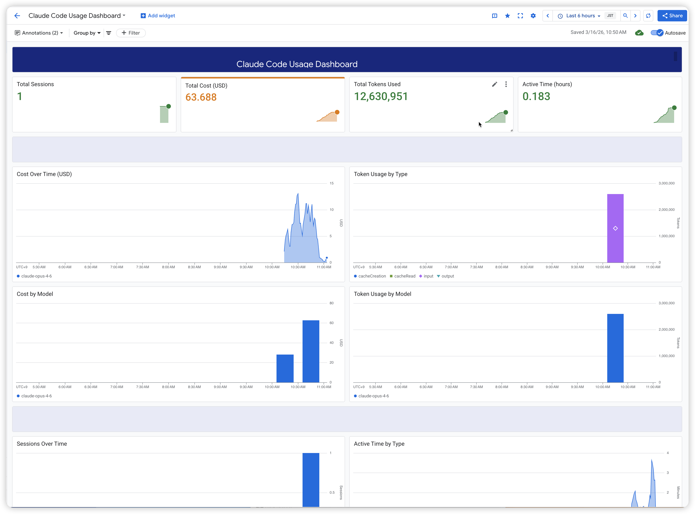

# Claude Code OpenTelemetry → GCP

Collect Claude Code telemetry data (metrics and logs) into Google Cloud Platform using an OpenTelemetry Collector deployed on Cloud Run.

## Architecture

```
Claude Code CLI
    │
    │ OTLP/HTTP (protobuf)
    │ + IAM Identity Token
    ▼
Cloud Run (OTel Collector)
    │
    ├──→ Cloud Monitoring (GMP)  ← metrics
    └──→ Cloud Logging           ← logs
```

## Collected Data

### Metrics (Cloud Monitoring)

Search for `claude_code` in Metrics Explorer:

| Metric | Description |
|---|---|
| `claude_code_cost_usage_USD_total` | Cost in USD |
| `claude_code_token_usage_tokens_total` | Token usage |
| `claude_code_session_count_total` | Session count |
| `claude_code_active_time_seconds_total` | Active time |
| `claude_code_lines_of_code_count_total` | Lines of code |
| `claude_code_code_edit_tool_decision_total` | Code edit decisions |

### Logs (Cloud Logging)

Query with `logName="projects/<PROJECT>/logs/opentelemetry-collector"`:

| Event | Key Fields |
|---|---|
| `claude_code.user_prompt` | Prompt content, length, session ID |
| `claude_code.api_request` | Model, tokens, cost (USD), duration |
| `claude_code.tool_result` | Tool name, success, duration |

## Prerequisites

- GCP project with the following APIs enabled:
  - Cloud Run API
  - Secret Manager API
  - Cloud Monitoring API
  - Cloud Logging API
- `gcloud` CLI installed and authenticated
- Terraform >= 1.0
- Claude Code installed (`npm install -g @anthropic-ai/claude-code`)

## Deployment Guide

### Step 1: Clone the Repository

```bash
git clone https://github.com/jinseo-jang/claude-code-otel-gcp.git
cd claude-code-otel-gcp
```

### Step 2: Configure Variables

Copy the example tfvars file and set your project ID:

```bash
cd terraform
cp terraform.tfvars.example terraform.tfvars
```

Edit `terraform.tfvars`:

```hcl
project_id = "your-gcp-project-id"
# region   = "us-central1"        # optional, defaults to us-central1
```

> **Note**: `terraform.tfvars` is git-ignored to prevent project-specific information from being committed.

### Step 3: Deploy Infrastructure

```bash
terraform init
terraform plan    # Review the changes
terraform apply   # Deploy
```

This creates:
- A **Cloud Run** service running the Google-built OTel Collector
- A **Secret Manager** secret containing the collector config
- A **Service Account** with `monitoring.metricWriter`, `logging.logWriter`, and `secretmanager.secretAccessor` roles
- An **IAM binding** granting `run.invoker` to the default compute service account

Note the `collector_url` output — you'll need it for Claude Code configuration.

### Step 4: Grant Access to Claude Code Users

Each user running Claude Code needs `roles/run.invoker` on the collector service:

```bash
gcloud run services add-iam-policy-binding claude-code-otel-collector \
  --region=us-central1 \
  --project=<PROJECT_ID> \
  --member="user:<USER_EMAIL>" \
  --role="roles/run.invoker"
```

### Step 5: Create the Authentication Headers Script

Create `~/.claude/generate_otel_headers.sh`:

```bash
#!/bin/bash
set -e
TOKEN=$(gcloud auth print-identity-token 2>/dev/null)
if [ -n "$TOKEN" ]; then
  echo "{\"Authorization\": \"Bearer $TOKEN\"}"
fi
```

```bash
chmod +x ~/.claude/generate_otel_headers.sh
```

> **CRITICAL**: The script **MUST** output a valid JSON object. Claude Code internally
> calls `JSON.parse()` on the output. Plain text like `Authorization: Bearer <token>`
> will cause a parse error and **silently disable all telemetry export**.

Verify it outputs valid JSON:

```bash
~/.claude/generate_otel_headers.sh | python3 -c "import sys,json; json.load(sys.stdin); print('OK')"
```

### Step 6: Configure Claude Code

Add the following to `~/.claude/settings.json` (or merge into your existing settings):

```json
{
  "env": {
    "CLAUDE_CODE_ENABLE_TELEMETRY": "1",
    "OTEL_METRICS_EXPORTER": "otlp",
    "OTEL_LOGS_EXPORTER": "otlp",
    "OTEL_EXPORTER_OTLP_PROTOCOL": "http/protobuf",
    "OTEL_EXPORTER_OTLP_ENDPOINT": "https://<COLLECTOR_URL>",
    "OTEL_METRICS_INCLUDE_SESSION_ID": "true",
    "OTEL_METRICS_INCLUDE_VERSION": "true",
    "OTEL_METRICS_INCLUDE_ACCOUNT_UUID": "true",
    "OTEL_LOG_USER_PROMPTS": "1",
    "OTEL_LOG_TOOL_DETAILS": "1",
    "OTEL_METRIC_EXPORT_INTERVAL": "60000"
  },
  "otelHeadersHelper": "/home/<USER>/.claude/generate_otel_headers.sh"
}
```

> **Notes**:
> - `OTEL_EXPORTER_OTLP_PROTOCOL` must be `http/protobuf`. Claude Code uses HTTP, not gRPC.
> - `otelHeadersHelper` must be an **absolute path**.
> - `OTEL_METRIC_EXPORT_INTERVAL` is in milliseconds (default: `60000`). Do **NOT** set this below `60000` — lower values cause `Duplicate TimeSeries` errors in Google Managed Prometheus.

### Step 7: Restart Claude Code

Restart Claude Code for the settings to take effect.

## Verification & Testing

After deployment, follow these steps to confirm the end-to-end pipeline is working.

### 1. Verify Collector is Running

```bash
gcloud run services describe claude-code-otel-collector \
  --region=us-central1 --project=<PROJECT_ID> \
  --format="value(status.conditions[0].status)"
```

Expected output: `True`

### 2. Test Collector Endpoint Connectivity

```bash
TOKEN=$(gcloud auth print-identity-token)

# Test metrics endpoint
curl -s -o /dev/null -w "metrics: HTTP %{http_code}\n" \
  -X POST -H "Authorization: Bearer $TOKEN" \
  -H "Content-Type: application/x-protobuf" \
  "https://<COLLECTOR_URL>/v1/metrics"

# Test logs endpoint
curl -s -o /dev/null -w "logs:    HTTP %{http_code}\n" \
  -X POST -H "Authorization: Bearer $TOKEN" \
  -H "Content-Type: application/x-protobuf" \
  "https://<COLLECTOR_URL>/v1/logs"
```

Expected: `HTTP 200` for both endpoints.

### 3. Send a Test Log Entry

```bash
TOKEN=$(gcloud auth print-identity-token)
curl -s -X POST \
  -H "Authorization: Bearer $TOKEN" \
  -H "Content-Type: application/json" \
  "https://<COLLECTOR_URL>/v1/logs" \
  -d '{
    "resourceLogs": [{
      "resource": {
        "attributes": [{"key": "service.name", "value": {"stringValue": "manual-test"}}]
      },
      "scopeLogs": [{
        "logRecords": [{
          "timeUnixNano": "'$(date +%s)000000000'",
          "body": {"stringValue": "OTel integration test"},
          "severityText": "INFO"
        }]
      }]
    }]
  }'
```

Then verify it appears in Cloud Logging (allow ~10 seconds for propagation):

```bash
gcloud logging read \
  'logName="projects/<PROJECT_ID>/logs/opentelemetry-collector" AND textPayload="OTel integration test"' \
  --project=<PROJECT_ID> --limit=1 --format=json
```

### 4. Verify Claude Code Telemetry is Flowing

Run any Claude Code command, then check if the collector received requests:

```bash
gcloud logging read \
  'resource.type="cloud_run_revision"
   AND resource.labels.service_name="claude-code-otel-collector"
   AND httpRequest.requestUrl:"/v1/"' \
  --project=<PROJECT_ID> --limit=10 \
  --format="table(timestamp,httpRequest.status,httpRequest.requestUrl,httpRequest.userAgent)"
```

Look for:
- **User-Agent**: `OTel-OTLP-Exporter-JavaScript/*` (confirms Claude Code is sending data)
- **Status**: `200` (confirms collector accepted the data)
- **URLs**: `/v1/metrics` and `/v1/logs` (confirms both pipelines are active)

### 5. Verify Logs in Cloud Logging

```bash
gcloud logging read \
  'logName="projects/<PROJECT_ID>/logs/opentelemetry-collector"' \
  --project=<PROJECT_ID> --limit=5 \
  --format="table(timestamp,labels.\"service.name\",textPayload)"
```

Expected: entries with `service.name: claude-code` and events like `claude_code.user_prompt`, `claude_code.api_request`, `claude_code.tool_result`.

### 6. Verify Metrics in Cloud Monitoring

Open **GCP Console > Cloud Monitoring > Metrics Explorer** and search for:

```
prometheus.googleapis.com/claude_code
```

You should see metrics like:
- `claude_code_cost_usage_USD_total`
- `claude_code_token_usage_tokens_total`
- `claude_code_session_count_total`

Alternatively, verify via CLI:

```bash
gcloud monitoring time-series list \
  --project=<PROJECT_ID> \
  --filter='metric.type = starts_with("prometheus.googleapis.com/claude_code")' \
  --limit=5 \
  --format="table(metric.type,points[0].value)"
```

### Quick Health Check (All-in-One)

Run this script to perform a quick end-to-end health check:

```bash
#!/bin/bash
PROJECT_ID="<PROJECT_ID>"
COLLECTOR_URL="<COLLECTOR_URL>"
TOKEN=$(gcloud auth print-identity-token)

echo "=== 1. Cloud Run Service Status ==="
gcloud run services describe claude-code-otel-collector \
  --region=us-central1 --project=$PROJECT_ID \
  --format="value(status.conditions[0].status)"

echo ""
echo "=== 2. Endpoint Connectivity ==="
echo -n "  /v1/metrics: "
curl -s -o /dev/null -w "HTTP %{http_code}" -X POST \
  -H "Authorization: Bearer $TOKEN" \
  "$COLLECTOR_URL/v1/metrics"
echo ""
echo -n "  /v1/logs:    "
curl -s -o /dev/null -w "HTTP %{http_code}" -X POST \
  -H "Authorization: Bearer $TOKEN" \
  "$COLLECTOR_URL/v1/logs"

echo ""
echo ""
echo "=== 3. Recent Requests (last 5) ==="
gcloud logging read \
  "resource.type=\"cloud_run_revision\" AND resource.labels.service_name=\"claude-code-otel-collector\" AND httpRequest.requestUrl:\"/v1/\"" \
  --project=$PROJECT_ID --limit=5 \
  --format="table(timestamp,httpRequest.status,httpRequest.userAgent)"

echo ""
echo "=== 4. Recent Log Entries ==="
gcloud logging read \
  "logName=\"projects/$PROJECT_ID/logs/opentelemetry-collector\"" \
  --project=$PROJECT_ID --limit=3 \
  --format="table(timestamp,labels.\"service.name\",textPayload)"

echo ""
echo "=== 5. Collector Errors (if any) ==="
gcloud logging read \
  "resource.type=\"cloud_run_revision\" AND resource.labels.service_name=\"claude-code-otel-collector\" AND severity>=ERROR" \
  --project=$PROJECT_ID --limit=3 \
  --format="value(timestamp,textPayload)"
```

## Dashboard

A pre-built Cloud Monitoring dashboard is included to visualize Claude Code usage metrics.



### Dashboard Widgets

| Section | Widgets |
|---|---|
| **Summary** | Total Sessions, Total Cost (USD), Total Tokens Used, Active Time (hours) |
| **Cost & Token Usage** | Cost Over Time, Token Usage by Type, Cost by Model, Token Usage by Model |
| **Sessions & Activity** | Sessions Over Time, Active Time by Type |
| **Productivity** | Lines of Code, Code Edit Decisions, Lines by Language |
| **Cost Efficiency** | Cost per Session, Tokens per Session, Lines per Dollar, Cache Hit Ratio |

### Deploy the Dashboard

The dashboard is deployed automatically with `terraform apply` (via `terraform/dashboard.tf`).

To deploy it separately:

```bash
cd terraform
terraform apply -target=google_monitoring_dashboard.claude_code
```

After deployment, find it in **GCP Console > Cloud Monitoring > Dashboards > Claude Code Usage Dashboard**.

### Grafana Dashboard (Optional)

A Grafana-compatible dashboard is also available at [`claude-code-dashboard.json`](claude-code-dashboard.json). Import it into your Grafana instance connected to a Prometheus/GMP data source.

## Key Gotchas

| Issue | Solution |
|---|---|
| `otelHeadersHelper` output is not JSON | Use `echo "{\"Authorization\": \"Bearer $TOKEN\"}"` |
| `OTEL_EXPORTER_OTLP_PROTOCOL=grpc` | Change to `http/protobuf` (Claude Code uses HTTP) |
| Data loss from cold starts | Set Cloud Run `min-instances=1` |
| 403 authentication errors | Grant `roles/run.invoker` to the user |
| `Duplicate TimeSeries` errors in GMP | Set `OTEL_METRIC_EXPORT_INTERVAL` to `60000` or higher |

For detailed troubleshooting, see [docs/plans/troubleshooting.md](docs/plans/troubleshooting.md).

## Docs

- [Setup Guide](docs/plans/claude-code-setup-guide.md) — Detailed Claude Code configuration guide
- [Design](docs/plans/2026-03-14-otel-gcp-design.md) — Architecture design document
- [Troubleshooting](docs/plans/troubleshooting.md) — Issue diagnosis and resolution guide
