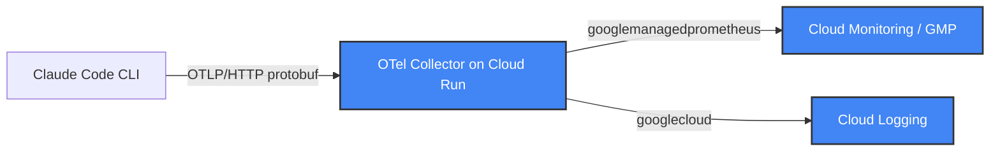

# Design: OpenTelemetry Integration with GCP for Claude Code

## Overview

This design outlines the architecture and configuration to send OpenTelemetry (OTel) data from Claude Code to Google Cloud Platform (GCP) for monitoring and visualization.

## Architecture

Claude Code exports telemetry via OTLP/HTTP to a centralized OpenTelemetry Collector on Cloud Run. The Collector routes metrics to Google Cloud Managed Service for Prometheus (GMP) and logs to Cloud Logging.

> [!IMPORTANT]
> **GKE is NOT required.** GMP is a managed service. The Cloud Run Collector writes to it directly via the `googlemanagedprometheus` exporter.



## Components

### 1. Claude Code Configuration

**Protocol**: `http/protobuf` (Claude Code's OTLP SDK uses HTTP, not gRPC)

**Environment Variables** (set via `~/.claude/settings.json` `env` block):

| Variable | Value | Notes |
|---|---|---|
| `CLAUDE_CODE_ENABLE_TELEMETRY` | `1` | Required to enable export |
| `OTEL_METRICS_EXPORTER` | `otlp` | |
| `OTEL_LOGS_EXPORTER` | `otlp` | |
| `OTEL_EXPORTER_OTLP_PROTOCOL` | `http/protobuf` | Must be HTTP, not gRPC |
| `OTEL_EXPORTER_OTLP_ENDPOINT` | `https://<collector-url>` | Cloud Run URL |
| `OTEL_METRICS_INCLUDE_SESSION_ID` | `true` | |
| `OTEL_METRICS_INCLUDE_VERSION` | `true` | |
| `OTEL_METRICS_INCLUDE_ACCOUNT_UUID` | `true` | |
| `OTEL_LOG_USER_PROMPTS` | `1` | Include prompt content in logs |
| `OTEL_LOG_TOOL_DETAILS` | `1` | Include tool execution details |
| `OTEL_METRIC_EXPORT_INTERVAL` | `1000` | Export every 1s (ms) |

**Dynamic Headers Helper** (`~/.claude/generate_otel_headers.sh`):

```bash
#!/bin/bash
set -e
TOKEN=$(gcloud auth print-identity-token 2>/dev/null)
if [ -n "$TOKEN" ]; then
  echo "{\"Authorization\": \"Bearer $TOKEN\"}"
fi
```

> [!CAUTION]
> The script **MUST output valid JSON**. Claude Code calls `JSON.parse()` on the output.
> Plain text output (e.g., `Authorization: Bearer <token>`) causes a silent failure
> that completely disables telemetry export. See [troubleshooting.md](troubleshooting.md).

Configure in `~/.claude/settings.json`:
```json
{
  "otelHeadersHelper": "/home/<user>/.claude/generate_otel_headers.sh"
}
```

### 2. OpenTelemetry Collector (Cloud Run)

**Image**: `us-docker.pkg.dev/cloud-ops-agents-artifacts/google-cloud-opentelemetry-collector/otelcol-google:0.144.0`

**Deployment**:
- **Platform**: Cloud Run
- **Port**: 4318 (OTLP HTTP)
- **Authentication**: IAM-secured (require authentication)
- **Min instances**: 1 (prevents cold start data loss)
- **CPU boost**: Enabled (faster startup)
- **Configuration**: Stored in Secret Manager, mounted as volume

**Collector Configuration** (`otel-config.yaml`):

```yaml
receivers:
  otlp:
    protocols:
      http:
        cors:
          allowed_origins:
            - http://*
            - https://*
        endpoint: 0.0.0.0:4318

processors:
  batch:
    send_batch_max_size: 200
    send_batch_size: 200
    timeout: 5s
  memory_limiter:
    check_interval: 1s
    limit_percentage: 65
    spike_limit_percentage: 20
  resourcedetection:
    detectors: [gcp]
    timeout: 10s
  transform/collision:
    metric_statements:
      - context: datapoint
        statements:
          - set(attributes["exported_location"], attributes["location"])
          - delete_key(attributes, "location")
          - set(attributes["exported_cluster"], attributes["cluster"])
          - delete_key(attributes, "cluster")
          - set(attributes["exported_namespace"], attributes["namespace"])
          - delete_key(attributes, "namespace")
          - set(attributes["exported_job"], attributes["job"])
          - delete_key(attributes, "job")
          - set(attributes["exported_instance"], attributes["instance"])
          - delete_key(attributes, "instance")
          - set(attributes["exported_project_id"], attributes["project_id"])
          - delete_key(attributes, "project_id")

exporters:
  googlemanagedprometheus:
  googlecloud:
    log:
      default_log_name: opentelemetry-collector
  debug:
    verbosity: detailed

extensions:
  health_check:
    endpoint: 0.0.0.0:13133

service:
  extensions: [health_check]
  pipelines:
    metrics:
      receivers: [otlp]
      processors: [resourcedetection, transform/collision, memory_limiter, batch]
      exporters: [googlemanagedprometheus, debug]
    logs:
      receivers: [otlp]
      processors: [resourcedetection, memory_limiter, batch]
      exporters: [googlecloud, debug]
```

Key design decisions:
- **No gRPC receiver**: Claude Code only uses HTTP. Removing gRPC avoids port conflict on Cloud Run.
- **`transform/collision` processor**: Renames GCP-reserved metric attributes (`location`, `cluster`, `namespace`, etc.) to `exported_*` to prevent conflicts with `googlemanagedprometheus`.
- **`resourcedetection` processor**: Auto-detects GCP metadata (project, region, instance).
- **`debug` exporter**: Included for troubleshooting. Can be removed in production.

### 3. IAM Permissions

| Principal | Role | Purpose |
|---|---|---|
| Collector SA | `roles/monitoring.metricWriter` | Write metrics to GMP |
| Collector SA | `roles/logging.logWriter` | Write logs to Cloud Logging |
| Collector SA | `roles/secretmanager.secretAccessor` | Read collector config |
| Users/SAs running Claude Code | `roles/run.invoker` | Invoke Cloud Run endpoint |

## Collected Data

### Cloud Logging (`logName: opentelemetry-collector`)

| Event | Key Fields |
|---|---|
| `claude_code.user_prompt` | `prompt`, `prompt_length`, `session.id` |
| `claude_code.api_request` | `model`, `input_tokens`, `output_tokens`, `cost_usd`, `duration_ms` |
| `claude_code.tool_result` | `tool_name`, `success`, `duration_ms` |

### Cloud Monitoring (Prometheus Metrics)

| Metric | Type |
|---|---|
| `prometheus.googleapis.com/claude_code_cost_usage_USD_total/counter` | Counter |
| `prometheus.googleapis.com/claude_code_token_usage_tokens_total/counter` | Counter |
| `prometheus.googleapis.com/claude_code_session_count_total/counter` | Counter |
| `prometheus.googleapis.com/claude_code_active_time_seconds_total/counter` | Counter |
| `prometheus.googleapis.com/claude_code_lines_of_code_count_total/counter` | Counter |
| `prometheus.googleapis.com/claude_code_code_edit_tool_decision_total/counter` | Counter |
