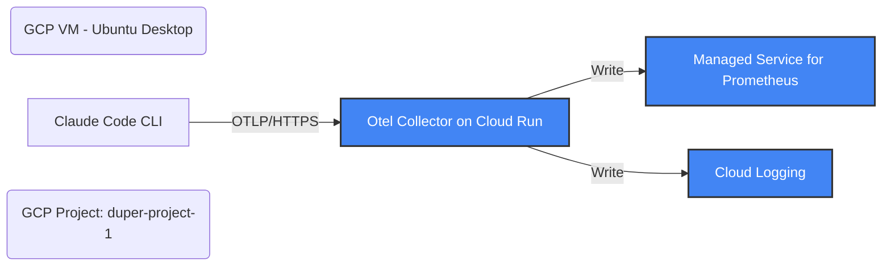

# Design: OpenTelemetry Integration with GCP for Claude Code

## Overview
This design outlines the architecture and configuration to send OpenTelemetry (otel) data from Claude Code to Google Cloud Platform (GCP) for visualization. 

## Architecture
The solution involves a centralized OpenTelemetry Collector deployed on Cloud Run, acting as a gateway. Claude Code (running on a GCP VM) will be configured to send its telemetry data to this collector. The collector will then route the data to the appropriate GCP services: Google Cloud Managed Service for Prometheus (for metrics) and Cloud Logging (for logs).

> [!IMPORTANT]
> **GKE (Google Kubernetes Engine) is NOT required** for this setup. GMP is a managed service, and the Cloud Run collector can send data to it directly.



## Components

### 1. Claude Code Configuration
Claude Code will be configured to enable telemetry and export metrics and logs to the Cloud Run collector's endpoint.

**Environment Variables:**
*   `CLAUDE_CODE_ENABLE_TELEMETRY=1`
*   `OTEL_METRICS_EXPORTER=otlp`
*   `OTEL_LOGS_EXPORTER=otlp`
*   `OTEL_EXPORTER_OTLP_PROTOCOL=grpc` (or `http/json`)
*   `OTEL_EXPORTER_OTLP_ENDPOINT=https://<collector-cloud-run-url>`
*   `OTEL_EXPORTER_OTLP_HEADERS`: Will be dynamically set using the `otelHeadersHelper`.
*   **추가 설정 (모든 데이터 수집)**:
    *   `OTEL_METRICS_INCLUDE_SESSION_ID=true`
    *   `OTEL_METRICS_INCLUDE_VERSION=true`
    *   `OTEL_METRICS_INCLUDE_ACCOUNT_UUID=true`
    *   `OTEL_LOG_USER_PROMPTS=1` (유저 프롬프트 내용 포함)
    *   `OTEL_LOG_TOOL_DETAILS=1` (도구 실행 상세 내용 포함)
    *   `OTEL_METRIC_EXPORT_INTERVAL=10000` (디버깅/확인용, 선택사항)

**Dynamic Headers Helper:**
A script will be created at `~/.claude/generate_otel_headers.sh` (or a similar path) to generate the required `Authorization` header. Since Claude Code is running on a GCP VM and using ADC, we can generate the token robustly.

```bash
#!/bin/bash
# Try gcloud first (works if user is logged in)
TOKEN=$(gcloud auth print-identity-token --audiences="https://<collector-cloud-run-url>" 2>/dev/null)

if [ -z "$TOKEN" ]; then
  # Try metadata server (works if using VM Service Account)
  TOKEN=$(curl -s -H "Metadata-Flavor: Google" "http://metadata.google.internal/computeMetadata/v1/instance/service-accounts/default/identity?audience=https://<collector-cloud-run-url>" 2>/dev/null)
fi

if [ -n "$TOKEN" ]; then
    echo "{\"Authorization\": \"Bearer $TOKEN\"}"
else
    # Fallback or error
    echo "{}"
fi
```
This requires configuring `.claude/settings.json`:
```json
{
  "otelHeadersHelper": "~/.claude/generate_otel_headers.sh"
}
```

### 2. OpenTelemetry Collector (Cloud Run)
We will use the official Google-Built OpenTelemetry Collector image: `us-docker.pkg.dev/cloud-ops-agents-artifacts/google-cloud-opentelemetry-collector/otelcol-google`.

**Deployment:**
*   **Platform**: Cloud Run
*   **Authentication**: "Require authentication" (secured by IAM). Only users or service accounts with the `roles/run.invoker` role on the service can send data.
*   **Configuration**: The collector configuration (`config.yaml`) will be stored in Secret Manager and mounted as a volume.

**Collector Configuration (`config.yaml`):**
```yaml
receivers:
  otlp:
    protocols:
      grpc:
      http:

processors:
  batch:
  resource:
    attributes:
      - key: service.name
        value: claude-code
        action: upsert

exporters:
  # Using googlemanagedprometheus for explicit GMP support
  googlemanagedprometheus:
  # Using googlecloud for standard GCP exporting (logs, traces)
  googlecloud:

service:
  pipelines:
    metrics:
      receivers: [otlp]
      processors: [batch, resource]
      exporters: [googlemanagedprometheus]
    logs:
      receivers: [otlp]
      processors: [batch, resource]
      exporters: [googlecloud]
```

### 3. IAM Permissions
*   **Cloud Run Service Account**:
    *   `roles/monitoring.metricWriter` (for writing metrics)
    *   `roles/logging.logWriter` (for writing logs)
*   **Users running Claude Code**:
    *   `roles/run.invoker` on the Collector Cloud Run service.

## Detailed Verification Plan

### 1. Collector Deployment Verification
*   **Step 1**: After running `terraform apply`, check the Cloud Run service status in the GCP Console (`duper-project-1`).
*   **Step 2**: Check Cloud Run logs for successful startup:
    *   Look for "Everything is ready. Begin running and processing data."
    *   Verify receivers are started: "Receiver is starting... (otlp)".
*   **Step 3**: (Optional) Test the endpoint from the VM using `curl`.
    *   `curl -i https://<collector-cloud-run-url>`
    *   *Expected*: Should return `401 Unauthorized` or `403 Forbidden` if secured by IAM, confirming the endpoint is active but protected.

### 2. Claude Code Authentication Verification
*   **Step 1**: Manually run the `generate_otel_headers.sh` script on the VM.
    *   `~/.claude/generate_otel_headers.sh`
    *   *Expected*: Output should be a JSON object containing the `Authorization` header with a Bearer token.
*   **Step 2**: Verify the token is valid for the Cloud Run audience.
    *   Run `gcloud auth print-identity-token --audiences="https://<collector-cloud-run-url>"` separately and compare.

### 3. End-to-End Integration Verification
*   **Step 1**: Configure Claude Code with the environment variables and `settings.json` (as detailed in Components).
*   **Step 2**: Run a simple Claude Code command (e.g., `claude --help` or ask a simple question).
*   **Step 3**: Check Cloud Run logs for incoming requests.
    *   *Expected*: You should see OTLP export requests being processed.
*   **Step 4**: Check Cloud Run logs for successful exports to GCP backends.
    *   Look for logs from `googlemanagedprometheus` and `googlecloud` exporters.

### 4. GCP Visualization Verification (Phase 1)

**4.1. Metrics in GMP**
*   **Step 1**: Go to GCP Console -> Cloud Monitoring -> Metrics Explorer.
*   **Step 2**: Switch to **PROMQL** mode.
*   **Step 3**: Query for Claude Code metrics.
    *   `claude_code_session_count_total`
    *   `claude_code_cost_usage_total`
    *   `claude_code_token_usage_total`
    *   *(Note: Metrics might appear with a different prefix depending on collector mapping, we will browse if PromQL fails).*
*   **Step 4**: Verify values are incrementing as you use Claude Code.

**4.2. Logs in Cloud Logging**
*   **Step 1**: Go to GCP Console -> Cloud Logging -> Logs Explorer.
*   **Step 2**: Enter a query to filter for Claude Code logs.
    *   `jsonPayload.event_name="user_prompt"` OR `jsonPayload.event_name="tool_result"`.
*   **Step 3**: Expand a log entry and verify it contains the expected attributes (e.g., `prompt_length`, `tool_name`).

### 5. Specific Metrics/Events Checklist
Verify that *all* items from `https://code.claude.com/docs/en/monitoring-usage#available-metrics-and-events` appear:
-   [ ] Metrics: `session.count`, `lines_of_code.count`, `pull_request.count`, `commit.count`, `cost.usage`, `token.usage`, `code_edit_tool.decision`, `active_time.total`.
-   [ ] Events: `user_prompt`, `tool_result`, `api_request`.
-   [ ] Attributes: `session.id`, `app.version`, `user.account_uuid`, etc.

### 6. Phase 2: Visualization (Dashboard)
(추후 진행) 데이터 수집이 안정화된 후, 위 발견된 메트릭을 바탕으로 Terraform(`google_monitoring_dashboard`) 또는 GCP Console을 통해 영구적인 시각화 대시보드를 구축합니다.

## Questions/Clarifications
*   Confirming the exact metric names exported by Claude Code (to help finding them in GMP).
*   Verifying if `otelcol-google` includes `googlemanagedprometheus` exporter by default.
