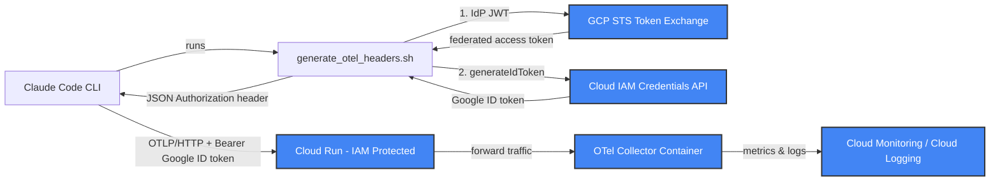

# Design: Corporate IdP Federated Authentication for Claude Code OTel

## 1. Context and Goal

The baseline implementation documented in `docs/plans/2026-03-14-otel-gcp-design.md` relies on developers obtaining a Google ID token directly via the local Google Cloud SDK:

- Developer workstations run `~/.claude/generate_otel_headers.sh`, which invokes `gcloud auth print-identity-token` and emits `{"Authorization": "Bearer $TOKEN"}`.
- `terraform/iam.tf` grants `roles/run.invoker` on the Cloud Run Collector service to the project's default compute service account (the base design doc in `2026-03-14-otel-gcp-design.md` lists "Users/SAs running Claude Code" as the intended `run.invoker` principals).

### The Problem

Every developer machine requires an active GCP IAM identity and a functioning `gcloud` login session. This introduces substantial operational friction:
- **Provisioning overhead**: Administrators must provision and maintain individual GCP IAM user accounts or Google Workspace identities for each developer.
- **Credential lifecycle**: Local `gcloud` sessions expire or require re-authentication, leading to dropped telemetry if credentials lapse silently.
- **Offboarding latency**: Access revocation must be maintained across both the corporate Identity Provider (IdP) and GCP IAM.

### The Goal

Allow the corporate IdP (such as Okta, Microsoft Entra ID, or Keycloak) to serve as the single source of truth for authentication and authorization without issuing per-developer GCP IAM identities or requiring `gcloud` installations on developer machines.

> [!NOTE]
> Per-user attribution is **NOT** a motivation for this design.
> As stated in the Claude Code Monitoring documentation:
> > When authenticated via OAuth, user.email is included in telemetry attributes, sent only to the OTel endpoint you configure, never to Anthropic.
>
> Telemetry metrics and logs already contain developer attribution within the OTLP payload itself. The objective here is strictly transport-level authentication and authorization to invoke the Cloud Run ingestion endpoint.

---

## 2. Verified Constraints

The following architectural constraints were validated against primary sources (collector build manifests, Go source code, GCP service documentation, and CLI inspections):

| ID | Topic | Primary Source | Verbatim Evidence / Exact Citation | Architectural Consequence |
|---|---|---|---|---|
| **F1** | Collector OIDC Extension Presence | `terraform/locals.tf` & `GoogleCloudPlatform/opentelemetry-operations-collector` v0.144.0 build manifest | `terraform/locals.tf` pins `us-docker.pkg.dev/cloud-ops-agents-artifacts/google-cloud-opentelemetry-collector/otelcol-google:0.144.0`. The build manifest at git tag `v0.144.0` contains `oidcauthextension` (grep count: 1). The v0.160.0 `extensions:` block includes, among others: `basicauthextension`, `bearertokenauthextension`, `googleclientauthextension`, `headerssetterextension`, `oidcauthextension`. | `oidcauthextension` is already compiled into the pinned collector image; no custom container build is needed if running OIDC auth inside the collector. |
| **F2** | OIDC Extension Configuration Schema | `extension/oidcauthextension/config.go` (v0.144.0) | `// The attribute (header name) to look for auth data. Optional, default value: "authorization".`<br>`Attribute string \`mapstructure:"attribute"\``<br><br>`// Deprecated: use Providers instead.`<br>`IssuerURL string \`mapstructure:"issuer_url"\``<br><br>`// Deprecated: use Providers instead.`<br>`Audience  string \`mapstructure:"audience"\`` | Flat `issuer_url` and `audience` fields are deprecated in favor of a `providers:` list. Custom header attributes can be specified via `attribute`. |
| **F3** | OIDC Extension AuthN Only (No AuthZ) | `extension/oidcauthextension/extension.go` (v0.144.0) | Go source inspected: strings.Split on the auth header requiring exactly 2 parts, getIssuerFromUnverifiedJWT(raw) to resolve the provider, then pc.verifier.Verify(ctx, raw). Full verbatim snippet reproduced in §4, Alternative A. | (a) Token MUST be a JWT because `iss` is parsed unverified to resolve the provider (opaque tokens fail).<br>(b) Header format must be two space-separated parts.<br>(c) Verifies signature, issuer, audience, and expiry only. `groups_claim` is surfaced into context but never enforced. Any user of that issuer holding a token with that audience is accepted. |
| **F4** | Cloud Armor JWT Validation Capability | GCP Cloud Armor Rules Language Reference (`https://cloud.google.com/armor/docs/rules-language-reference`) | The full text contains **zero** occurrences of the string `jwt` (case-insensitive). | Cloud Armor cannot inspect, decode, or validate JWT tokens at L7. It cannot act as an authentication gateway. |
| **F5** | IAP Programmatic External Identity Support | Identity-Aware Proxy Documentation (`https://cloud.google.com/iap/docs/authentication-howto`) | > Programmatic access refers to calling IAP-secured applications from non-browser clients, such as command-line tools, service-to-service calls, and mobile applications.<br><br>> Caution: Only Google Identities are supported for user account programmatic access in IAP. Identity Platform and Workforce Identity Federation identities are not supported for programmatic access. | IAP cannot accept non-Google identities for programmatic CLI calls. External identities require interactive browser redirects that an automated OTLP exporter cannot perform. |
| **F6** | Cloud Run Authorization Headers | Cloud Run Service-to-Service Documentation (`https://cloud.google.com/run/docs/authenticating/service-to-service`) | > You can include the ID token from the previous step in the request to the service by using an Authorization: Bearer ID_TOKEN header or an X-Serverless-Authorization: Bearer ID_TOKEN header.<br><br>> You can use this header if your application already uses the Authorization header for custom authorization.<br><br>> If both headers are provided, only the X-Serverless-Authorization header is checked.<br><br>> Receive authenticated requests Within the receiving private service, you can parse the authorization header to receive the information being sent by the Bearer token. | Cloud Run forwards `Authorization` directly to the container if `X-Serverless-Authorization` is used for Cloud Run IAM. IAM auth and container auth can coexist. |
| **F7** | WIF STS Token Type | GCP Workload Identity Federation Documentation (`https://cloud.google.com/iam/docs/workload-identity-federation`) | > The token exchange flow returns a federated access token. | Cloud Run service-URL invocation requires an OIDC **ID token**. WIF returns an **access token**, making a second hop (`iamcredentials.generateIdToken`) mandatory. |
| **F8** | Combined Permissions in Workload Identity User Role | Output of `gcloud iam roles describe roles/iam.workloadIdentityUser` | `iam.serviceAccounts.get;iam.serviceAccounts.getAccessToken;iam.serviceAccounts.getOpenIdToken;iam.serviceAccounts.list` | `getOpenIdToken` is included in `roles/iam.workloadIdentityUser`. A single role binding covers both STS exchange and `generateIdToken`. No separate `roles/iam.serviceAccountTokenCreator` is required. |
| **F9** | Claude Code Dynamic Headers Helper Debounce | Claude Code Monitoring Documentation | `CLAUDE_CODE_OTEL_HEADERS_HELPER_DEBOUNCE_MS` — "Interval for refreshing dynamic headers (default: 1740000ms / 29 minutes)". | The helper script is executed at most once every 29 minutes by default. All tokens obtained must remain valid across this interval. |

---

## 3. Chosen Design — Workload Identity Federation

To preserve Cloud Run IAM-level protection without managing individual Google user accounts, we select **Workload Identity Federation (WIF)** paired with a dedicated intermediate invocation service account.

### Architecture Overview



### Key Architectural Invariants
- **`otel-config.yaml` is completely unchanged**: The collector runs with the exact same pipeline configuration, processors, and exporters.
- **`cloud_run.tf` is completely unchanged**: The Cloud Run service remains private and requires IAM authentication. `allUsers` is NOT permitted.
- **Scope of change**: Changes are restricted exclusively to:
  1. Terraform provisioning of WIF pool, WIF provider, and an intermediate invocation Service Account.
  2. The local `~/.claude/generate_otel_headers.sh` helper script executed on developer machines.

### The Two-Hop Token Exchange

Because Cloud Run URL-based invocation requires a Google-signed OIDC ID token, and GCP STS returns a federated OAuth2 access token (F7), the client performs two consecutive HTTP calls:

#### Hop 1: STS Token Exchange
Exchange the corporate IdP JWT for a federated GCP access token scoped to Cloud Platform:

```bash
curl -s -X POST "https://sts.googleapis.com/v1/token" \
  -H "Content-Type: application/json; charset=utf-8" \
  -d '{
    "grantType": "urn:ietf:params:oauth:grant-type:token-exchange",
    "subjectTokenType": "urn:ietf:params:oauth:token-type:jwt",
    "subjectToken": "<CORPORATE_IDP_JWT>",
    "requestedTokenType": "urn:ietf:params:oauth:token-type:access_token",
    "scope": "https://www.googleapis.com/auth/cloud-platform",
    "audience": "//iam.googleapis.com/projects/<PROJECT_NUMBER>/locations/global/workloadIdentityPools/<POOL>/providers/<PROVIDER>"
  }'
```

#### Hop 2: Service Account ID Token Generation
Using the federated access token, impersonate the intermediate invocation service account to generate a Google ID token with Cloud Run as the target audience:

```bash
curl -s -X POST "https://iamcredentials.googleapis.com/v1/projects/-/serviceAccounts/<SA_EMAIL>:generateIdToken" \
  -H "Authorization: Bearer <FEDERATED_ACCESS_TOKEN>" \
  -H "Content-Type: application/json; charset=utf-8" \
  -d '{
    "audience": "https://<collector-url>",
    "includeEmail": true
  }'
```

### Headers Helper Script (`~/.claude/generate_otel_headers.sh`)

The script below serves as the complete replacement for the local headers helper.

> [!CAUTION]
> As documented in [troubleshooting.md](troubleshooting.md), Claude Code calls `JSON.parse()` on the output of this script. Any non-JSON stdout (such as error messages or curl progress) causes an unhandled parsing error that **silently disables all telemetry exports**.
> The script must fail completely silently with no stdout output on any error.

```bash
#!/bin/bash
# ~/.claude/generate_otel_headers.sh
# Obtains corporate IdP JWT, exchanges via STS for a federated access token,
# and generates a Google ID token for Cloud Run.
#
# CRITICAL: Must exit silently with zero stdout on any failure.
# Non-JSON stdout permanently suppresses Claude Code telemetry.

set -euo pipefail

# Trap unexpected errors to exit silently without emitting text
trap 'exit 0' ERR

# -----------------------------------------------------------------------------
# Configuration (Replace with deployment parameters)
# -----------------------------------------------------------------------------
PROJECT_NUMBER="<PROJECT_NUMBER>"
POOL_ID="claude-code-pool"
PROVIDER_ID="corporate-idp-provider"
SERVICE_ACCOUNT_EMAIL="claude-code-otel-invoker@<PROJECT_ID>.iam.gserviceaccount.com"
COLLECTOR_URL="https://claude-code-otel-collector-<hash>-<region>.a.run.app"

# 1. Retrieve Corporate IdP JWT from environment or local credential store
IDP_TOKEN="${CORPORATE_IDP_TOKEN:-}"
if [ -z "$IDP_TOKEN" ] && [ -f "$HOME/.corporate_idp/token" ]; then
  IDP_TOKEN=$(cat "$HOME/.corporate_idp/token" 2>/dev/null || true)
fi

if [ -z "$IDP_TOKEN" ]; then
  exit 0
fi

AUDIENCE="//iam.googleapis.com/projects/${PROJECT_NUMBER}/locations/global/workloadIdentityPools/${POOL_ID}/providers/${PROVIDER_ID}"

# 2. Hop 1: STS Token Exchange
STS_RESPONSE=$(curl -s -f -X POST "https://sts.googleapis.com/v1/token" \
  -H "Content-Type: application/json; charset=utf-8" \
  -d "{
    \"grantType\": \"urn:ietf:params:oauth:grant-type:token-exchange\",
    \"audience\": \"${AUDIENCE}\",
    \"scope\": \"https://www.googleapis.com/auth/cloud-platform\",
    \"requestedTokenType\": \"urn:ietf:params:oauth:token-type:access_token\",
    \"subjectTokenType\": \"urn:ietf:params:oauth:token-type:jwt\",
    \"subjectToken\": \"${IDP_TOKEN}\"
  }" 2>/dev/null || true)

if [ -z "$STS_RESPONSE" ]; then
  exit 0
fi

FEDERATED_ACCESS_TOKEN=$(echo "$STS_RESPONSE" | grep -o '"access_token": *"[^"]*"' | sed 's/"access_token": *"//;s/"//' 2>/dev/null || true)

if [ -z "$FEDERATED_ACCESS_TOKEN" ]; then
  exit 0
fi

# 3. Hop 2: Generate Google ID Token
ID_TOKEN_RESPONSE=$(curl -s -f -X POST "https://iamcredentials.googleapis.com/v1/projects/-/serviceAccounts/${SERVICE_ACCOUNT_EMAIL}:generateIdToken" \
  -H "Authorization: Bearer ${FEDERATED_ACCESS_TOKEN}" \
  -H "Content-Type: application/json; charset=utf-8" \
  -d "{
    \"audience\": \"${COLLECTOR_URL}\",
    \"includeEmail\": true
  }" 2>/dev/null || true)

if [ -z "$ID_TOKEN_RESPONSE" ]; then
  exit 0
fi

GOOGLE_ID_TOKEN=$(echo "$ID_TOKEN_RESPONSE" | grep -o '"token": *"[^"]*"' | sed 's/"token": *"//;s/"//' 2>/dev/null || true)

if [ -z "$GOOGLE_ID_TOKEN" ]; then
  exit 0
fi

# 4. Output valid JSON header object
echo "{\"Authorization\": \"Bearer ${GOOGLE_ID_TOKEN}\"}"
```

### IAM Permissions Structure

Matching the style of the base design document, permissions are partitioned as follows:

| Principal | Role | Purpose |
|---|---|---|
| `principalSet://iam.googleapis.com/projects/<PROJECT_NUMBER>/locations/global/workloadIdentityPools/<POOL>/attribute.group/<AUTHORIZED_GROUP>` | `roles/iam.workloadIdentityUser` | Exchange federated STS token and call `generateIdToken` on intermediate SA (verified in F8) |
| Intermediate Invoker SA (`claude-code-otel-invoker@<PROJECT_ID>.iam.gserviceaccount.com`) | `roles/run.invoker` | Authorize ID tokens issued for this SA to invoke the Cloud Run Collector service |
| Collector SA (`claude-code-otel-collector-sa@<PROJECT_ID>.iam.gserviceaccount.com`) | `roles/monitoring.metricWriter` | Unchanged: Write metrics to Google Cloud Managed Service for Prometheus |
| Collector SA (`claude-code-otel-collector-sa@<PROJECT_ID>.iam.gserviceaccount.com`) | `roles/logging.logWriter` | Unchanged: Write logs to Cloud Logging |
| Collector SA (`claude-code-otel-collector-sa@<PROJECT_ID>.iam.gserviceaccount.com`) | `roles/secretmanager.secretAccessor` | Unchanged: Read collector configuration from Secret Manager |

### Workload Identity Pool Provider Specification (HCL Snippet)

The following minimal HCL demonstrates the critical configuration for token validation, attribute mapping, and group membership enforcement:

```hcl
resource "google_iam_workload_identity_pool_provider" "corporate_idp" {
  workload_identity_pool_id          = "claude-code-pool"
  workload_identity_pool_provider_id = "corporate-idp-provider"
  display_name                       = "Corporate IdP OIDC Provider"

  attribute_mapping = {
    "google.subject"       = "assertion.sub"
    "attribute.email"      = "assertion.email"
    "attribute.group"      = "assertion.groups"
  }

  # Enforce corporate group membership at the STS perimeter
  attribute_condition = "'engineers' in assertion.groups"

  oidc {
    issuer_uri        = "https://corporate-idp.example.com/oauth2/default"
    allowed_audiences = ["https://claude-code-otel.example.com"]
  }
}
```

> [!NOTE]
> No `.tf` file has been written yet. The snippet above is a design specification illustrating only the security-critical mapping and condition parameters.

---

## 4. Alternatives Considered

### Alternative A: Collector In-Container `oidcauthextension` (Viable but Rejected)

- **Description**: Configure the OpenTelemetry Collector's receiver with `oidcauthextension`. Primary source F1 confirms that `oidcauthextension` is already compiled into the pinned collector image (`otelcol-google:0.144.0`), eliminating the need for custom image builds.
- **Why Rejected**:
  1. **Exposure of Cloud Run**: Cloud Run must be configured with `allUsers` granted `roles/run.invoker` so incoming requests reach the container without a Google-signed identity token.
  2. **Authentication Only, No Authorization (F3)**: Go source inspection (`extension/oidcauthextension/extension.go`) reveals:
     ```go
     parts := strings.Split(authHeaders[0], " ")
     if len(parts) != 2 {
         return ctx, errInvalidAuthenticationHeaderFormat
     }
     raw := parts[1]
     unverifiedIssuer, err := getIssuerFromUnverifiedJWT(raw)
     pc, err := e.resolveProvider(unverifiedIssuer)
     idToken, err := pc.verifier.Verify(ctx, raw)
     ```
     The extension only verifies cryptographic validity, issuer, audience, and expiry. Although `groups_claim` is parsed into Go context, it is **never enforced**. Consequently, *any* active identity in the corporate IdP tenant with a token targeting that audience would be authorized to emit metrics and logs into GCP. WIF’s `attribute_condition` closes this vulnerability.
- **Fair Assessment**: This alternative is structurally simpler (a single direct HTTP hop from Claude Code to Cloud Run) and easier to troubleshoot locally. However, public exposure of Cloud Run combined with the inability to restrict access by corporate group makes it unsuitable for production environments requiring strict group-level access controls.

### Alternative B: Cloud Armor Security Policy

- **Description**: Deploy a Google Cloud Armor security policy at an external Application Load Balancer in front of Cloud Run to inspect and validate JWT tokens before forwarding traffic.
- **Why Rejected**: As verified in F4, the full text of `https://cloud.google.com/armor/docs/rules-language-reference` contains **zero** occurrences of the string `jwt` (case-insensitive). Cloud Armor operates as an L7 WAF and DDoS/rate-limiting engine; it does not contain a JWT validation filter or OIDC client.

### Alternative C: Identity-Aware Proxy (IAP)

- **Description**: Secure Cloud Run behind IAP and authenticate developer CLI requests using corporate federated credentials.
- **Why Rejected**: As quoted verbatim in F5 from `https://cloud.google.com/iap/docs/authentication-howto`:
  > Programmatic access refers to calling IAP-secured applications from non-browser clients, such as command-line tools, service-to-service calls, and mobile applications.
  > Caution: Only Google Identities are supported for user account programmatic access in IAP. Identity Platform and Workforce Identity Federation identities are not supported for programmatic access.
  IAP does not support programmatic invocation with non-Google identities. It relies on standard browser 302 redirects, which cannot be traversed by headless CLI OTLP exporters.

### Alternative D: Mutual TLS (mTLS)

- **Description**: Configure Claude Code to authenticate to the collector via mTLS client certificates.
- **Evaluation**: Primary source F11 notes that Claude Code explicitly supports mTLS for the OTLP exporter (documented in the Claude Code Monitoring guide under "mTLS authentication"). If the enterprise possesses an active Public Key Infrastructure (PKI) and automated workstation certificate deployment, mTLS eliminates token expiry and header refresh entirely.
- **Status**: Not selected because WIF aligns with existing corporate IdP OAuth2/OIDC standards without requiring workstation PKI infrastructure.

### Alternative E: Layered Header Dual-Auth (`X-Serverless-Authorization` + `Authorization`)

- **Description**: Use F6's documented Cloud Run capability:
  > You can include the ID token from the previous step in the request to the service by using an Authorization: Bearer ID_TOKEN header or an X-Serverless-Authorization: Bearer ID_TOKEN header.
  > You can use this header if your application already uses the Authorization header for custom authorization.
  > If both headers are provided, only the X-Serverless-Authorization header is checked.
  Pass a generic Google ID token in `X-Serverless-Authorization` for Cloud Run IAM, and pass the corporate IdP JWT in `Authorization` for the collector's `oidcauthextension`.
- **Why Rejected**: Represents maximum complexity (managing two credentials simultaneously in the helper script) for negligible benefit once WIF already enforces corporate group authorization at the GCP perimeter.

---

## 5. Identity Provider Matrix

The following table contrasts the configuration requirements across major corporate IdPs.

> [!IMPORTANT]
> The parameters listed below represent documented IdP specifications and standard protocol behaviors. None of these IdP configurations have been executed or tested in a live environment.

| Feature / Gotcha | Okta | Microsoft Entra ID | Keycloak |
|---|---|---|---|
| **Issuer URI Format** | `https://<org>.okta.com/oauth2/<authServerId>` | `https://login.microsoftonline.com/<tenant>/v2.0` | `https://<host>/realms/<realm>` |
| **Audience Configuration** | Configured within the Custom Authorization Server under *Settings → Audiences*. | Configured as Application ID URI (`api://<client-id>`) in *Expose an API*. | Configured via an *Audience* client scope or protocol mapper in client settings. |
| **Groups Claim Availability** | Must be added explicitly to the Custom Authorization Server claims (e.g., claim name `groups`, value regex `.*`). | Configured in app manifest via `groupMembershipClaims`. Note: Returns group Object IDs (GUIDs) unless directory sync formats names. | Configured via a `Group Membership` protocol mapper added to client scopes. |
| **Token-Type Gotcha** | **Critical**: The default Okta Org Authorization Server (`https://<org>.okta.com`) issues **opaque** access tokens. Opaque tokens fail F3 and fail GCP STS token exchange. A **Custom Authorization Server** is required to emit signed JWT access tokens; per Okta's documentation this is a separately licensed capability, which we have not confirmed for this organization. | Tokens must use the v2.0 endpoint to align with OIDC discovery. Default graph access tokens cannot be verified by third parties. | Emits standard JWTs by default. Must ensure realm public keys are resolvable via `.well-known/openid-configuration`. |
| **Refresh Token Requirement** | **Mandatory**: The Native Application in Okta must have the **`Refresh Token`** grant type enabled in *General Settings*. Omitting this causes Okta to drop the refresh token silently, forcing browser re-authentication every hour once the 60-minute access token expires. | Requires `offline_access` scope and standard Entra ID refresh token policies. | Enable *Refresh Token* grant type under client configuration. |

---

## 6. Operations

### Token Lifetime vs. Debounce Interval (F9)

The Claude Code monitoring subsystem debounces dynamic header generation based on:
`CLAUDE_CODE_OTEL_HEADERS_HELPER_DEBOUNCE_MS` — "Interval for refreshing dynamic headers (default: 1740000ms / 29 minutes)".

- **Risk**: If either the corporate IdP JWT, the federated access token, or the final Google ID token expires before 29 minutes elapses, subsequent OTLP export requests fail with HTTP 401/403 until the debounce window expires.
- **Mitigation**:
  1. Google ID tokens generated via `iamcredentials.googleapis.com` are valid for **1 hour (3600 seconds)**, which safely exceeds the 29-minute debounce window.
  2. The corporate IdP token issued to the developer must have a lifetime 60 minutes or longer, or `CLAUDE_CODE_OTEL_HEADERS_HELPER_DEBOUNCE_MS` must be configured to a lower interval (e.g., `300000` for 5 minutes).

### Silent-Exit Enforcement

As established in [troubleshooting.md](troubleshooting.md), non-JSON output from the headers helper script causes Claude Code's internal `JSON.parse()` to fail silently, disabling all telemetry for the remainder of the session.
- The helper script traps all errors (`trap 'exit 0' ERR`) and discards stderr (`2>/dev/null`).
- If any network call fails, the script exits cleanly without emitting output to stdout.

### Systematic Debugging Order

When verifying or troubleshooting the federated authentication pipeline, execute checks in this strict sequential order:

1. **Test Helper Output Format**: Execute the helper script directly and ensure it returns valid JSON:
   ```bash
   ~/.claude/generate_otel_headers.sh | python3 -m json.tool
   ```
2. **Inspect Corporate JWT**: Decode the IdP token payload without verification to inspect claims:
   ```bash
   echo "$IDP_TOKEN" | cut -d'.' -f2 | base64 -d 2>/dev/null | python3 -m json.tool
   # Confirm: iss matches WIF provider, aud matches allowed_audiences, exp is valid, groups claim exists
   ```
3. **Isolate STS Exchange (Hop 1)**: Execute the `curl` call to `https://sts.googleapis.com/v1/token` directly and confirm an `access_token` is returned.
4. **Isolate ID Token Generation (Hop 2)**: Execute the `curl` call to `https://iamcredentials.googleapis.com/v1/...:generateIdToken` using the federated access token and confirm a Google `token` is returned.
5. **Verify Cloud Run Direct Ingestion**: Send a test ping to the collector with the generated Google ID token:
   ```bash
   curl -s -o /dev/null -w "%{http_code}\n" \
     -H "Authorization: Bearer $GOOGLE_ID_TOKEN" \
     -X POST "https://<collector-url>/v1/metrics"
   # Expected status: 200 (or 415/400 if empty body, but NOT 401 or 403)
   ```
6. **Inspect Cloud Run Request Logs**: If requests fail with 401 or 403, query Cloud Run revision logs:
   ```bash
   gcloud logging read \
     'resource.type="cloud_run_revision" AND resource.labels.service_name="claude-code-otel-collector"' \
     --limit=10 --format="table(timestamp,httpRequest.status,textPayload)"
   ```

---

## 7. Unverified Assumptions

To maintain complete transparency and technical integrity, the following boundaries must be stated explicitly:

> [!WARNING]
> **No live Okta or third-party IdP tenant exists for this project. Nothing in this document has been executed or tested end-to-end.**

### What Was Actually Verified
1. The OpenTelemetry collector image pinned in `terraform/locals.tf` (`otelcol-google:0.144.0`) contains `oidcauthextension` in its build manifest.
2. The Go source code of `oidcauthextension` v0.144.0 confirms that token validation is authentication-only (no group-based authorization filtering).
3. The official GCP documentation confirms Cloud Armor's lack of JWT support, IAP's lack of programmatic external identity support, Cloud Run's dual-header handling (`X-Serverless-Authorization` vs `Authorization`), and WIF STS returning access tokens.
4. The local execution of `gcloud iam roles describe roles/iam.workloadIdentityUser` confirms the presence of `iam.serviceAccounts.getOpenIdToken`.

### Assumptions Requiring Future Live Validation
- **IdP Token Format**: Assumes the corporate IdP can be configured to issue signed JWT tokens (not opaque strings) with a stable audience claim and an embedded `groups` claim.
- **CEL Condition Evaluation**: The exact CEL syntax in WIF's `attribute_condition` depends on how the IdP serializes the groups claim (JSON array vs. space-separated string).
- **Workstation Token Availability**: Assumes developer workstations have a reliable, automated mechanism (e.g., enterprise CLI tool, local daemon, or cache file) to place a fresh IdP token at `$HOME/.corporate_idp/token` or populate `$CORPORATE_IDP_TOKEN`.
