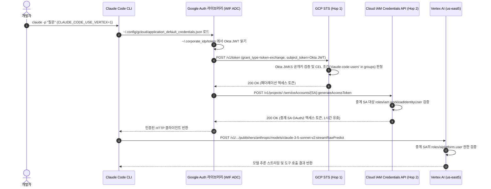
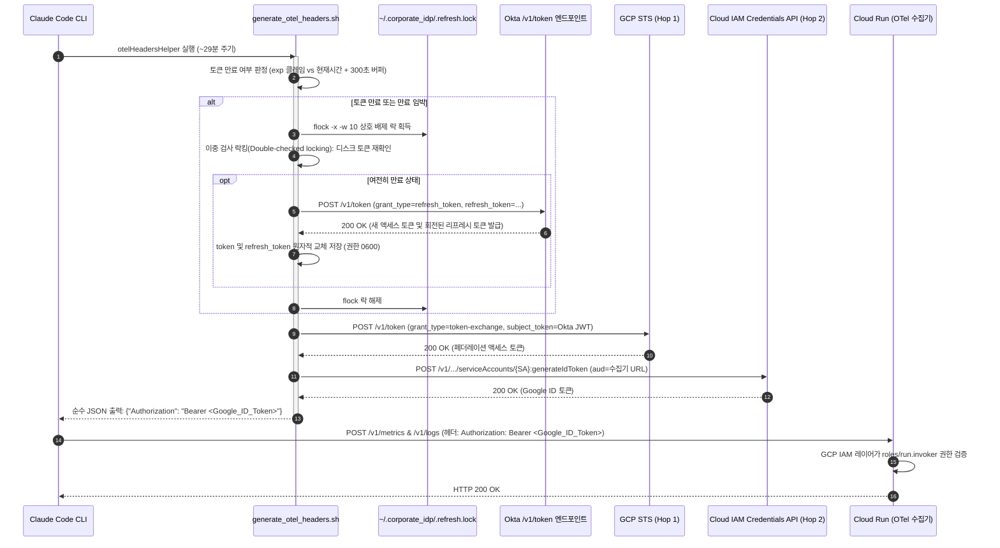

# Okta 연동 Workload Identity Federation (WIF) 통합 참조 아키텍처
## Zero-`gcloud` 기반 Vertex AI Claude 모델 호출 및 Cloud Run OTel 텔레메트리 연동

> **Language**: [English](README.md) | **한국어**

기업 Identity Provider(Okta)를 단일 인증 원천으로 사용하여, 개별 개발자에게 GCP IAM 계정을 발급하거나 로컬 `gcloud` 인증 세션을 유지하지 않고도 **Vertex AI 기반 Claude 모델 호출**과 **Cloud Run OpenTelemetry 수집기 텔레메트리(메트릭·로그) 전송**을 동시에 처리하는 통합 참조 아키텍처입니다.

---

## 1. 통합 아키텍처 개요

기존 방식에서는 Google Cloud 상에서 Claude Code를 운영하기 위해 각 개발자 머신마다 개별 IAM 계정 발급, 권한 부여, 주기적인 `gcloud auth login` 재인증이 필요했습니다. 이는 운영팀의 프로비저닝 부담을 가중시키고, 토큰 만료로 인한 개발 중단 및 퇴사자 권한 회수 지연 등의 보안 취약점을 야기했습니다.

본 아키텍처는 **단일 Okta SSO 세션**을 통해 이 모든 문제를 해결합니다:
1. **모델 호출 경로 (Vertex AI)**: Claude Code가 Google Cloud WIF ADC(`external_account`) 설정을 통해 Anthropic Claude 3.5 / 3.7 Sonnet 모델을 `gcloud` 로그인 없이 투명하게 호출합니다.
2. **텔레메트리 수집 경로 (Cloud Run OTel)**: Claude Code의 세션 메트릭과 구조화 로그를 인증 헬퍼 스크립트(`generate_otel_headers.sh`)를 통한 2-Hop 토큰 교환 방식으로 비공개 Cloud Run 수집기로 안전하게 전송합니다.
3. **자율 복원 토큰 수명주기**: OAuth 2.0 리프레시 토큰(`offline_access`)을 활용하여 액세스 토큰 만료 시 Okta `/v1/token` 엔드포인트에서 백그라운드 자동 갱신을 수행하며, POSIX 파일 락(`flock`)과 원자적 파일 교체로 토큰 갱신 경합을 원천 차단합니다.

### 1-1. 시스템 아키텍처 구성도

```mermaid
flowchart TB
    subgraph Client["개발자 환경 (Cloud Workstations / 로컬 워크스테이션)"]
        CC["Claude Code CLI<br/>(CLAUDE_CODE_USE_VERTEX=1)"]
        
        subgraph Storage["보안 토큰 저장소 (~/.corporate_idp, 권한 0700)"]
            TokenFile[("token<br/>(Okta 액세스 토큰, 권한 0600)")]
            RefreshTokenFile[("refresh_token<br/>(OAuth 리프레시 토큰, 권한 0600)")]
            LockFile[(".refresh.lock<br/>(flock 동시성 제어 락)")]
        end
        
        subgraph AuthConfig["클라이언트 인증 설정"]
            ADC["WIF ADC 설정<br/>(~/.config/gcloud/application_default_credentials.json)"]
            HelperScript["OTel 헤더 헬퍼<br/>(~/.claude/generate_otel_headers.sh)"]
        end
    end

    subgraph IdP["기업 Identity Provider (Okta)"]
        OktaServer["Okta 커스텀 권한 부여 서버<br/>(https://<YOUR_OKTA_DOMAIN>/oauth2/default)"]
        OktaTokenEndpoint["토큰 엔드포인트<br/>(/v1/token, grant_type=refresh_token)"]
        UserIdentity["사내 사용자 및 인가 그룹<br/>('claude-code-users')"]
    end

    subgraph GCP["Google Cloud Platform (프로젝트: duper-project-1)"]
        subgraph WIF["Workload Identity Federation"]
            STS["GCP STS (Security Token Service)<br/>https://sts.googleapis.com/v1/token"]
            Pool["Workload Identity Pool<br/>(claude-code-pool)"]
            Provider["OIDC 프로바이더 (okta-oidc-provider)<br/>JWKS 서명 검증 및 CEL 조건: 'claude-code-users' in assertion.groups"]
        end

        subgraph IAM["Cloud IAM Credentials 및 중계 서비스 계정"]
            RelaySA["중계 서비스 계정 (Relay SA)<br/>(claude-code-otel-invoker@duper-project-1.iam.gserviceaccount.com)<br/>roles/iam.workloadIdentityUser"]
            IAMCreds["Cloud IAM Credentials API<br/>iamcredentials.googleapis.com"]
        end

        subgraph Endpoints["대상 Google Cloud 서비스"]
            VertexAI["Vertex AI Claude 모델<br/>(us-east5-aiplatform.googleapis.com)<br/>IAM: roles/aiplatform.user"]
            CloudRun["Cloud Run OTel 수집기<br/>(비공개 인그레스, allUsers 차단)<br/>IAM: roles/run.invoker"]
        end

        subgraph Observability["옵저버빌리티 백엔드"]
            GCM["Google Cloud Monitoring<br/>(Prometheus 시계열 메트릭)"]
            GCL["Google Cloud Logging<br/>(opentelemetry-collector 구조화 로그)"]
        end
    end

    %% 로그인 및 갱신
    UserIdentity -->|1. 디바이스 플로우 인증| OktaServer
    OktaServer -.->|액세스 토큰 및 리프레시 토큰 발급| Storage
    HelperScript <-->|flock 기반 백그라운드 자동 갱신| OktaTokenEndpoint

    %% 경로 A: Vertex AI 모델 호출 (WIF ADC)
    CC -->|"경로 A: 모델 호출 (WIF ADC 참조)"| ADC
    ADC -->|"캐시된 토큰 로드"| TokenFile
    ADC -->|"1단계: Okta JWT 교환"| STS
    STS <-->|"JWKS 및 CEL 조건 검증"| Provider
    STS -->|"페더레이션 액세스 토큰"| ADC
    ADC -->|"2단계: generateAccessToken"| IAMCreds
    IAMCreds <-->|"SA 임퍼소네이션 검증"| RelaySA
    IAMCreds -->|"SA 액세스 토큰"| ADC
    ADC -->|"StreamRawPredict (Claude 3.5 Sonnet)"| VertexAI

    %% 경로 B: Cloud Run OTel 텔레메트리
    CC -->|"경로 B: OTel 헤더 조회 (~29분 주기)"| HelperScript
    HelperScript -->|"캐시된 토큰 로드"| TokenFile
    HelperScript -->|"1단계: Okta JWT 교환"| STS
    HelperScript -->|"2단계: generateIdToken (aud: 수집기 URL)"| IAMCreds
    HelperScript -->|"JSON 반환: Authorization: Bearer <ID_Token>"| CC
    CC -->|"OTLP/HTTP 텔레메트리 전송"| CloudRun
    CloudRun -->|"메트릭 적재"| GCM
    CloudRun -->|"로그 적재"| GCL

    classDef gcp fill:#e8f0fe,stroke:#4285f4,stroke-width:1px;
    classDef client fill:#f1f3f4,stroke:#5f6368,stroke-width:1px;
    classDef idp fill:#fef7e0,stroke:#fbbc04,stroke-width:1px;
    class GCP,WIF,IAM,Endpoints,Observability,STS,Pool,Provider,IAMCreds,RelaySA,VertexAI,CloudRun,GCM,GCL gcp;
    class Client,CC,Storage,AuthConfig,ADC,HelperScript,TokenFile,RefreshTokenFile,LockFile client;
    class IdP,OktaServer,OktaTokenEndpoint,UserIdentity idp;
```



---

## 2. 이원화 실행 모델 (Dual-Path Execution Model)

통합 모델은 모델 호출 파이프라인과 텔레메트리 수집 파이프라인을 기술적으로 완전히 분리하면서도, 동일한 Okta 사용자 신원을 공유합니다:

### 2-1. 경로 A: Vertex AI 모델 호출 (WIF ADC 기반)

Claude Code 2.1+ 버전은 Google Cloud Vertex AI 모델 호출 시 Google Application Default Credentials(ADC)를 기본 참조합니다. 워크스테이션에 WIF `external_account` 설정 파일을 배치하면 `gcloud` 로그인 없이도 모델 추론을 수행할 수 있습니다.



### 2-2. 경로 B: Cloud Run OTel 텔레메트리 (OTel 헤더 헬퍼 기반)

비공개 Cloud Run 서비스 엔드포인트는 Cloud Run URL을 `aud` 클레임으로 포함하는 Google 서명 OIDC ID 토큰(`accounts.google.com`)을 요구합니다. 헬퍼 스크립트(`generate_otel_headers.sh`)가 2-Hop 토큰 교환을 거쳐 이 ID 토큰을 생성하고 Claude Code가 요구하는 JSON 형태로 출력합니다:



---

## 3. 견고한 토큰 수명주기 및 자동 갱신 (Token Lifecycle)

Okta에서 발급한 OAuth 2.0 액세스 토큰의 기본 유효기간은 60분입니다. 자동 갱신 메커니즘이 없으면 개발 작업 1시간 경과 후 텔레메트리가 자동으로 끊기게 됩니다.

### 3-1. `offline_access` 스코프 및 리프레시 토큰 발급
`login_okta_device.sh`의 디바이스 인증 요청에 `offline_access` 스코프를 포함합니다:
```bash
curl -s -X POST "${ISSUER_URI}/v1/device/authorize" \
  -H "Content-Type: application/x-www-form-urlencoded" \
  -d "client_id=${OKTA_CLIENT_ID}&scope=openid%20profile%20email%20offline_access"
```
사용자가 브라우저에서 승인을 완료하면 Okta는 `access_token`과 함께 `refresh_token`을 반환합니다.

### 3-2. 동시성 제어(`flock`) 및 이중 검사 락킹 (Double-Checked Locking)
Claude Code 프로세스나 여러 터미널 탭이 동시에 텔레메트리를 내보낼 때 여러 프로세스가 같은 리프레시 토큰으로 동시에 갱신을 요청할 수 있습니다. Okta의 **Refresh Token Reuse Detection** 정책은 동일한 리프레시 토큰의 중복 사용을 탈취 시도로 간주하여 사용자의 전체 세션을 즉시 무효화합니다.

이를 완벽히 차단하기 위해 다음과 같은 다계층 동시성 보호를 구현했습니다:
1. **POSIX 파일 락킹**: `generate_otel_headers.sh`는 `~/.corporate_idp/.refresh.lock` 파일에 대해 `flock -x -w 10 200`으로 배타적 락을 획득합니다.
2. **이중 검사 락킹 (Double-Checked Locking)**: 락을 획득한 후 즉시 `~/.corporate_idp/token`을 다시 읽어 다른 프로세스가 이미 토큰을 갱신했는지 확인합니다. 이미 갱신되었다면 중복 Okta 네트워크 호출을 즉시 건너뜁니다.
3. **원자적 파일 교체 (Atomic Rotation)**: 토큰을 디스크에 저장할 때 임시 파일에 `umask 077`로 기록한 뒤 `mv -f`로 교체하여 불완전한 상태의 토큰이 다른 프로세스에 노출되지 않도록 보장합니다:
   ```bash
   (umask 077 && printf '%s\n' "$NEW_ACCESS_TOKEN" > "${TOKEN_FILE}.tmp.$$" && mv -f "${TOKEN_FILE}.tmp.$$" "${TOKEN_FILE}")
   chmod 600 "${TOKEN_FILE}"
   ```
4. **리프레시 토큰 회전 수용**: Okta가 `/v1/token` 응답에서 새 리프레시 토큰을 회전 발행하면 `~/.corporate_idp/refresh_token` 또한 원자적으로 업데이트합니다.

### 3-3. 침묵 종료(Silent-Exit) 규약
Claude Code는 `otelHeadersHelper`의 표준 출력을 `JSON.parse()`로 처리합니다. 스크립트 실행 중 에러 메시지나 경고 문구가 표준 출력으로 1바이트라도 배출되면 JSON 파싱 에러가 발생하여 해당 세션의 텔레메트리 수집이 영구 중단됩니다.

따라서 헬퍼 스크립트는 다음 침묵 종료 규약을 철저히 준수합니다:
- **성공 시**: 표준 출력에 유효한 JSON `{"Authorization": "Bearer <ID_TOKEN>"}`만 출력하고 정상 종료 (`exit 0`).
- **장애/실패 시**: 표준 출력을 **0바이트(완전 공백)**로 유지하고 조용히 종료 (`exit 0`):
  ```bash
  trap 'exit 0' ERR EXIT
  ```

---

## 4. Terraform IAM 인프라 구성

통합 모델의 IAM 정책은 `idp-federation/terraform/iam.tf`에 선언되어 있습니다.

### 4-1. 비독점적(Non-Authoritative) IAM 바인딩 원칙
기존 프로젝트 수준의 IAM 바인딩(다른 개발자나 서비스 계정의 `roles/aiplatform.user` 권한)을 덮어쓰거나 삭제하지 않도록, 독점적 리소스(`google_project_iam_binding`/`policy`) 대신 비독점적 `google_project_iam_member`를 적용했습니다:

```hcl
# 중계 서비스 계정 정의
resource "google_service_account" "invoker" {
  account_id   = var.invoker_sa_name
  display_name = "Claude Code OTel Invoker Service Account"
  description  = "Intermediate service account impersonated by federated IdP identities"
}

# 1. Okta 인가 그룹 사용자의 중계 SA 권한 대행 허용
resource "google_service_account_iam_member" "wif_group_impersonator" {
  service_account_id = google_service_account.invoker.name
  role               = "roles/iam.workloadIdentityUser"
  member             = "principalSet://iam.googleapis.com/${google_iam_workload_identity_pool.claude_code.name}/group/${var.authorized_group}"
}

# 2. 중계 SA에 Cloud Run OTel 수집기 호출 권한 부여
resource "google_cloud_run_service_iam_member" "invoker_run_access" {
  location = var.region
  service  = var.service_name
  role     = "roles/run.invoker"
  member   = "serviceAccount:${google_service_account.invoker.email}"
}

# 3. 중계 SA에 Vertex AI Claude 모델 호출 권한 부여 (추가 바인딩)
resource "google_project_iam_member" "invoker_aiplatform_access" {
  project = var.project_id
  role    = "roles/aiplatform.user"
  member  = "serviceAccount:${google_service_account.invoker.email}"
}
```

### 4-2. 중계 SA 3대 필수 권한 비교
| 부여 역할 | 대상 리소스 | 역할 목적 |
|---|---|---|
| `roles/iam.workloadIdentityUser` | 중계 서비스 계정 (`claude-code-otel-invoker`) | Okta 인가 그룹(`claude-code-users`) 사용자가 GCP STS를 통해 중계 SA를 임퍼소네이션하도록 허용 |
| `roles/run.invoker` | Cloud Run 서비스 (`claude-code-otel-collector`) | OTel 텔레메트리 메트릭/로그 요청이 비공개 수집기 컨테이너에 도달하도록 인가 |
| `roles/aiplatform.user` | GCP 프로젝트 (`duper-project-1`) | Vertex AI Claude 모델 추론 API(`aiplatform.endpoints.predict`)를 호출하도록 인가 |

---

## 5. 디렉터리 구성

```
idp-federation/
├── README.md                      # 영문 통합 참조 가이드 문서
├── README.ko.md                   # 본 한글 통합 참조 가이드 문서
├── scripts/
│   ├── login_okta_device.sh       # Okta 디바이스 플로우 로그인 및 토큰 캐싱 (offline_access 포함)
│   ├── generate_otel_headers.sh   # 만료 검사, flock 자동 갱신, 2-Hop 교환, 침묵 종료 헬퍼
│   └── test_token_pipeline.sh     # 9단계 전수 진단 및 검증 도구 (--skip-curl 지원)
└── terraform/
    ├── provider.tf                # Google Cloud Provider 정의
    ├── variables.tf               # 프로젝트, WIF 풀/프로바이더, 인가 그룹 변수 정의
    ├── wif.tf                     # Workload Identity Pool 및 Okta OIDC 프로바이더
    ├── iam.tf                     # 중계 SA, WIF 바인딩, Run Invoker, AI Platform User 권한
    ├── outputs.tf                 # WIF 풀/프로바이더 식별자 및 수집기 URL 출력
    └── terraform.tfvars.example   # 환경 변수 설정 예시 파일
```

---

## 6. Okta 관리자 설정 가이드

설정 파라미터 (예시):
- **Okta 도메인**: `https://<YOUR_OKTA_DOMAIN>` (예: `https://integrator-4025180.okta.com`)
- **커스텀 권한 부여 서버**: `https://<YOUR_OKTA_DOMAIN>/oauth2/default`
- **인가 대상 그룹**: `claude-code-users`
- **Native App Client ID**: `<YOUR_OKTA_CLIENT_ID>` (예: `0oa17jpfd4fZxEdHE698`)

### 6-1. 그룹 및 사용자 생성
1. Okta Admin Console에서 **Directory** > **Groups**로 이동합니다.
2. `claude-code-users` 그룹을 생성하고 Claude Code를 사용할 사내 계정을 멤버로 추가합니다.

### 6-2. Native Application 설정 (디바이스 플로우 및 리프레시 토큰 활성화)
1. **Applications** > **Applications** > **Create App Integration**을 클릭합니다.
2. **OIDC - OpenID Connect** > **Native Application**을 선택합니다.
3. **Grant types**:
   - **`Device Authorization`** 체크 (필수)
   - **`Refresh Token`** 체크 (백그라운드 자동 갱신 필수)
4. **Assignments**: `claude-code-users` 그룹(또는 조직 전체)에 할당합니다.
5. 저장 후 발급된 **`Client ID`**를 복사합니다.

### 6-3. 커스텀 권한 부여 서버 설정 (`/oauth2/default`)
기본 조직 서버(`https://<org>.okta.com`)는 불투명 토큰을 발급하므로 GCP STS JWKS 서명 검증에 사용할 수 없습니다. 반드시 서명된 JWT를 발행하는 커스텀 서버(`default`)를 사용해야 합니다.

1. **Audiences 확인**: **Security** > **API** > **Authorization Servers** > **`default`** > **Settings**에서 **Audiences**에 `api://default`가 등록되어 있는지 확인합니다.
2. **Access Token에 `groups` 클레임 추가 (필수)**:
   - **Claims** 탭에서 **Add Claim**을 클릭합니다:
     - **Name**: `groups`
     - **Include in token type**: **`Access Token`** 선택 *(주의: ID Token이 아닌 Access Token이어야 함)*
     - **Value type**: `Groups`
     - **Filter**: `Matches regex` 선택 후 `.*` 입력
     - **Include in**: `Any scope`
3. **Access Policy 및 Rule 설정**:
   - **Access Policies** 탭에서 해당 앱에 할당된 정책의 Rule을 수정하거나 추가합니다.
   - **Grant type is**: **`Device Authorization`** 및 **`Refresh Token`** 체크.
   - **User is**: `Any user assigned to the app`.
   - **Scopes**: `Any scope`.

---

## 7. 9단계 통합 진단 파이프라인 (`test_token_pipeline.sh`)

Claude Code를 실행하기 전 인증 및 전송 체인의 모든 단계를 사전에 검증할 수 있는 통합 진단 도구를 제공합니다:

```bash
./idp-federation/scripts/test_token_pipeline.sh
```

### 7-1. 점검 단계 요약
| 단계 | 검증 대상 | 검증 내용 | 기대 결과 |
|---|---|---|---|
| **Step 1** | 로컬 Okta JWT | 파일 존재(`0600`), base64 디코딩, `iss`, `aud`, `groups` 클레임 점검 | `[PASS]` `claude-code-users` 포함 및 유효기간 확인 |
| **Step 2** | GCP STS (Hop 1) | Okta JWT를 `sts.googleapis.com/v1/token`으로 전송 | `[PASS]` JWKS 서명 통과 및 페더레이션 액세스 토큰 수신 |
| **Step 3** | Cloud IAM (Hop 2) | `iamcredentials.googleapis.com/...:generateIdToken` 호출 | `[PASS]` 수집기 URL을 오디언스로 하는 Google ID 토큰 발급 |
| **Step 4** | Cloud Run 수집기 | 발급된 토큰으로 `COLLECTOR_URL/v1/metrics` 도달 시험 | `[PASS]` Cloud Run IAM 인가 검증 통과 (HTTP 200) |
| **Step 5** | OTel 헤더 헬퍼 | `generate_otel_headers.sh` 단독 실행 | `[PASS]` 순수 JSON `{"Authorization": "Bearer eyJ..."}` 출력 |
| **Step 6** | 리프레시 토큰 | `~/.corporate_idp/refresh_token` (0600) 및 Okta `/v1/token` 갱신 시험 | `[PASS]` 리프레시 토큰 유효성 및 자동 회전 검증 |
| **Step 7** | SA 액세스 토큰 | `iamcredentials.googleapis.com/...:generateAccessToken` 호출 | `[PASS]` Vertex AI용 SA OAuth2 액세스 토큰 수신 |
| **Step 8** | Vertex AI 엔드포인트 | `us-east5-aiplatform.googleapis.com/.../publishers/anthropic/models` 호출 | `[PASS]` 모델 카탈로그 조회 및 `roles/aiplatform.user` 검증 |
| **Step 9** | WIF ADC 설정 | `~/.config/gcloud/application_default_credentials.json` 스키마 검증 | `[PASS]` 권한 0600, `type: external_account`, 올바른 중계 SA 지정 |

### 7-2. 오프라인 진단 모드 (`--skip-curl`)
폐쇄망 환경이거나 외부 네트워크 호출 없이 로컬 토큰 형식과 파일 권한만 빠르게 검증하려는 경우:
```bash
./idp-federation/scripts/test_token_pipeline.sh --skip-curl
```

---

## 8. 개발자 워크스테이션 빠른 시작 (Quickstart)

### 8-1. Okta 로그인 및 토큰 발급
```bash
export OKTA_CLIENT_ID="<YOUR_OKTA_CLIENT_ID>"
./idp-federation/scripts/login_okta_device.sh
```
터미널에 안내되는 브라우저 URL로 이동하여 8자리 코드를 입력하고 사내 계정으로 로그인합니다. 인증 완료 시 `~/.corporate_idp/`에 `token`과 `refresh_token`이 권한 `0600`으로 자동 저장됩니다.

### 8-2. WIF ADC 설정 파일 배치
`~/.config/gcloud/application_default_credentials.json` 파일을 작성합니다:
```bash
mkdir -p ~/.config/gcloud
cat << 'EOF' > ~/.config/gcloud/application_default_credentials.json
{
  "type": "external_account",
  "audience": "//iam.googleapis.com/projects/743441901636/locations/global/workloadIdentityPools/claude-code-pool/providers/okta-oidc-provider",
  "subject_token_type": "urn:ietf:params:oauth:token-type:jwt",
  "token_url": "https://sts.googleapis.com/v1/token",
  "credential_source": {
    "file": "/home/user/.corporate_idp/token"
  },
  "service_account_impersonation_url": "https://iamcredentials.googleapis.com/v1/projects/-/serviceAccounts/claude-code-otel-invoker@duper-project-1.iam.gserviceaccount.com:generateAccessToken"
}
EOF
chmod 600 ~/.config/gcloud/application_default_credentials.json
```
*(프로젝트 번호 `743441901636`, 프로젝트 ID `duper-project-1`, 홈 디렉터리 경로 `/home/user`는 환경에 맞게 수정).*

### 8-3. Claude Code 설정 (`~/.claude/settings.json`)
```bash
mkdir -p ~/.claude
cp idp-federation/scripts/generate_otel_headers.sh ~/.claude/generate_otel_headers.sh
chmod 755 ~/.claude/generate_otel_headers.sh

cat << 'EOF' > ~/.claude/settings.json
{
  "otelHeadersHelper": "/home/user/.claude/generate_otel_headers.sh",
  "env": {
    "CLAUDE_CODE_USE_VERTEX": "1",
    "CLOUD_ML_REGION": "global",
    "ANTHROPIC_MODEL": "claude-opus-4-8",
    "ANTHROPIC_VERTEX_PROJECT_ID": "duper-project-1",
    "CLAUDE_CODE_ENABLE_TELEMETRY": "1",
    "OTEL_METRICS_EXPORTER": "otlp",
    "OTEL_LOGS_EXPORTER": "otlp",
    "OTEL_EXPORTER_OTLP_PROTOCOL": "http/json",
    "OTEL_EXPORTER_OTLP_ENDPOINT": "https://claude-code-otel-collector-f7p5gpdmfa-uc.a.run.app",
    "OTEL_LOG_USER_PROMPTS": "1",
    "OTEL_LOG_TOOL_DETAILS": "1",
    "OTEL_METRIC_EXPORT_INTERVAL": "60000",
    "CLAUDE_CODE_OTEL_HEADERS_HELPER_DEBOUNCE_MS": "1740000"
  }
}
EOF
```

### 8-4. Claude Code 실행 (Zero-`gcloud`)
```bash
claude
```
별도의 `gcloud auth` 로그인 없이도 Okta 인증 자격증명을 통해 Vertex AI의 Claude 3.5 Sonnet 모델과 직접 대화하고, 세션 텔레메트리가 Cloud Run으로 실시간 전송됩니다.

---

## 9. 연관 문서

- [Cloud Workstations 환경 Claude Code 테스트 가이드 (한국어)](../test/workstation-claude-code-test-guide.ko.md): Cloud Workstations 환경에서 Claude Code 세션을 구동하고 실측 텔레메트리를 검증하는 상세 가이드.
- [Cloud Workstations Claude Code Testing Guide (English)](../test/workstation-claude-code-test-guide.md): Step-by-step procedures for validating Claude Code sessions on Cloud Workstations.
- [IdP 연동 아키텍처 설계 명세서](../docs/plans/2026-09-14-idp-federated-auth-design.md): WIF 2단계 토큰 교환 및 보안 경계 설계 상세 문서.
- [실측 검증 증적 기록서](../.agents/tests/2026-09-14-verification-evidence.md): Cloud Audit Logs, Cloud Monitoring 시계열, Cloud Run 200 실측 증적 원문.
