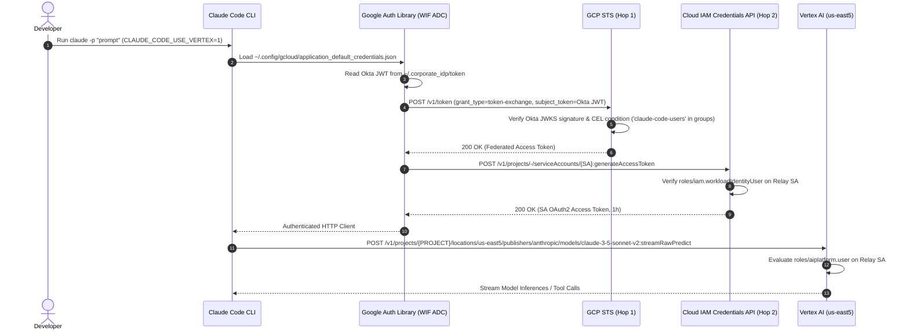
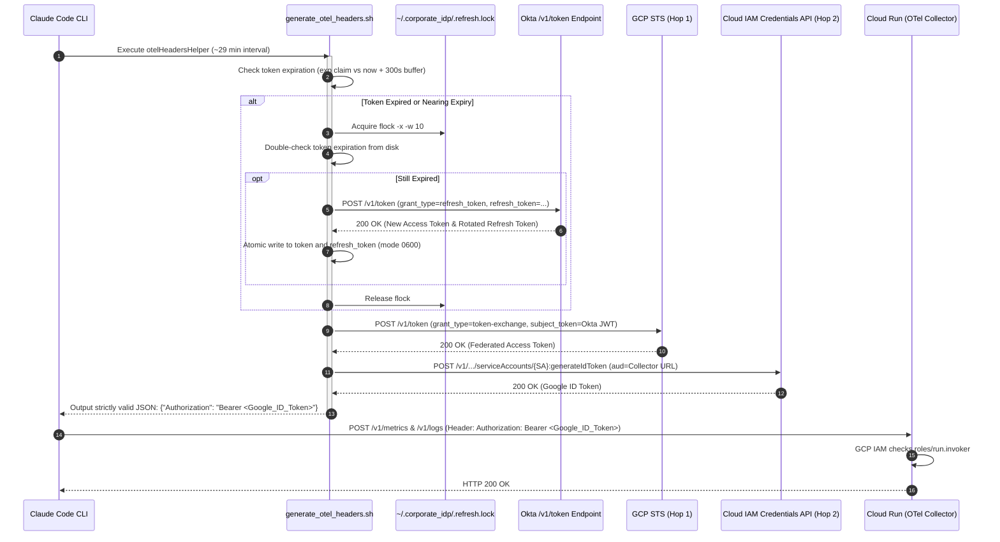

# Okta Workload Identity Federation (WIF) Unified Reference Architecture
## Zero-`gcloud` Claude Code on Vertex AI & Cloud Run OpenTelemetry Telemetry

> **Language**: **English** | [한국어 (Korean)](README.ko.md)

This reference architecture leverages an enterprise Identity Provider (Okta) as the single source of truth for identity, granting both **Vertex AI Claude model invocations** and **Cloud Run OpenTelemetry telemetry forwarding** without issuing individual Google Cloud IAM user accounts or managing persistent local `gcloud` sessions.

---

## 1. Unified Architecture Overview

Traditionally, developer workstation environments running Claude Code on Google Cloud required manual account provisioning, individual IAM accounts, and frequent `gcloud auth login` re-authentications. This created operational overhead, security friction, and delayed offboarding revocations.

This architecture unifies authentication under a **Single Okta SSO Session**:
1. **Model Invocation Path (Vertex AI)**: Claude Code transparently invokes Anthropic Claude 3.5 / 3.7 Sonnet models on Vertex AI via Google Cloud Application Default Credentials (WIF ADC) configured as an `external_account`.
2. **Telemetry Ingestion Path (Cloud Run OTel)**: Claude Code exports OpenTelemetry metrics and structured logs to a private, IAM-protected Cloud Run Collector via an authentication helper script (`generate_otel_headers.sh`) using a 2-hop token exchange.
3. **Resilient Token Lifecycle**: Automatically refreshes expired access tokens in the background via Okta's `/v1/token` endpoint using OAuth 2.0 refresh tokens (`offline_access`), secured by POSIX file locking (`flock`) and atomic file rotation.

### 1-1. System Architecture Diagram

```mermaid
flowchart TB
    subgraph Client["Developer Environment (Cloud Workstation / Local Workstation)"]
        CC["Claude Code CLI<br/>(CLAUDE_CODE_USE_VERTEX=1)"]
        
        subgraph Storage["Secure Token Store (~/.corporate_idp, 0700)"]
            TokenFile[("token<br/>(Okta Access Token, mode 0600)")]
            RefreshTokenFile[("refresh_token<br/>(OAuth Refresh Token, mode 0600)")]
            LockFile[(".refresh.lock<br/>(flock Concurrency Lock)")]
        end
        
        subgraph AuthConfig["Client Auth Configurations"]
            ADC["WIF ADC Config<br/>(~/.config/gcloud/application_default_credentials.json)"]
            HelperScript["OTel Headers Helper<br/>(~/.claude/generate_otel_headers.sh)"]
        end
    end

    subgraph IdP["Corporate Identity Provider (Okta)"]
        OktaServer["Okta Custom Auth Server<br/>(https://<YOUR_OKTA_DOMAIN>/oauth2/default)"]
        OktaTokenEndpoint["Token Endpoint<br/>(/v1/token, grant_type=refresh_token)"]
        UserIdentity["Corporate User & Group<br/>('claude-code-users')"]
    end

    subgraph GCP["Google Cloud Platform (Project: duper-project-1)"]
        subgraph WIF["Workload Identity Federation"]
            STS["GCP STS (Security Token Service)<br/>https://sts.googleapis.com/v1/token"]
            Pool["Workload Identity Pool<br/>(claude-code-pool)"]
            Provider["OIDC Provider (okta-oidc-provider)<br/>JWKS & Group CEL Rule: 'claude-code-users' in assertion.groups"]
        end

        subgraph IAM["Cloud IAM Credentials & Relay Service Account"]
            RelaySA["Relay Service Account<br/>(claude-code-otel-invoker@duper-project-1.iam.gserviceaccount.com)<br/>roles/iam.workloadIdentityUser"]
            IAMCreds["Cloud IAM Credentials API<br/>iamcredentials.googleapis.com"]
        end

        subgraph Endpoints["Target Google Cloud Services"]
            VertexAI["Vertex AI Claude Models<br/>(us-east5-aiplatform.googleapis.com)<br/>IAM: roles/aiplatform.user"]
            CloudRun["Cloud Run OTel Collector<br/>(Private Ingress, allUsers Denied)<br/>IAM: roles/run.invoker"]
        end

        subgraph Observability["Telemetry Backends"]
            GCM["Google Cloud Monitoring<br/>(Prometheus Time Series Metrics)"]
            GCL["Google Cloud Logging<br/>(opentelemetry-collector Structured Logs)"]
        end
    end

    %% Login & Refresh
    UserIdentity -->|1. Device Authorization Login| OktaServer
    OktaServer -.->|Issues Access Token + Refresh Token| Storage
    HelperScript <-->|Background Auto-Refresh under flock| OktaTokenEndpoint

    %% Path A: Vertex AI Model Invocation (WIF ADC)
    CC -->|"Path A: Model Invocations (Reads ADC)"| ADC
    ADC -->|"Reads Cached Token"| TokenFile
    ADC -->|"Hop 1: Exchange Okta JWT"| STS
    STS <-->|"Validate JWKS & CEL Rule"| Provider
    STS -->|"Federated Access Token"| ADC
    ADC -->|"Hop 2: generateAccessToken"| IAMCreds
    IAMCreds <-->|"Verify SA Impersonation"| RelaySA
    IAMCreds -->|"SA Access Token"| ADC
    ADC -->|"StreamRawPredict (Claude 3.5 Sonnet)"| VertexAI

    %% Path B: Cloud Run OTel Telemetry
    CC -->|"Path B: OTel Headers (Debounce ~29m)"| HelperScript
    HelperScript -->|"Reads Cached Token"| TokenFile
    HelperScript -->|"Hop 1: Exchange Okta JWT"| STS
    HelperScript -->|"Hop 2: generateIdToken (aud: Collector URL)"| IAMCreds
    HelperScript -->|"Returns JSON: Authorization: Bearer <ID_Token>"| CC
    CC -->|"Export OTLP/HTTP (protobuf/json)"| CloudRun
    CloudRun -->|"Ingest Metrics"| GCM
    CloudRun -->|"Ingest Logs"| GCL

    classDef gcp fill:#e8f0fe,stroke:#4285f4,stroke-width:1px;
    classDef client fill:#f1f3f4,stroke:#5f6368,stroke-width:1px;
    classDef idp fill:#fef7e0,stroke:#fbbc04,stroke-width:1px;
    class GCP,WIF,IAM,Endpoints,Observability,STS,Pool,Provider,IAMCreds,RelaySA,VertexAI,CloudRun,GCM,GCL gcp;
    class Client,CC,Storage,AuthConfig,ADC,HelperScript,TokenFile,RefreshTokenFile,LockFile client;
    class IdP,OktaServer,OktaTokenEndpoint,UserIdentity idp;
```



---

## 2. Dual-Path Execution Model

The unified architecture decouples model invocation from telemetry export while binding both to the same corporate Okta user identity:

### 2-1. Path A: Vertex AI Model Invocations (via WIF ADC)

Claude Code 2.1+ natively supports Google Cloud Vertex AI via Google Application Default Credentials (ADC). By deploying a WIF `external_account` ADC configuration, Claude Code interacts with Vertex AI without needing `gcloud auth login`.



### 2-2. Path B: Cloud Run OTel Telemetry (via OTel Headers Helper)

Private Cloud Run endpoints require an OIDC ID token (`accounts.google.com`) containing the Cloud Run service URL in its `aud` claim. The helper script executes a 2-hop exchange to mint this ID token and format it as Claude Code expects:



---

## 3. Resilient Token Lifecycle & Automated Refresh

OAuth 2.0 access tokens issued by Okta typically expire after 60 minutes. Without an automated refresh mechanism, developer sessions break after one hour, causing silent telemetry dropouts.

### 3-1. `offline_access` Scope & Token Issuance
In `login_okta_device.sh`, the device authorization request includes `offline_access`:
```bash
curl -s -X POST "${ISSUER_URI}/v1/device/authorize" \
  -H "Content-Type: application/x-www-form-urlencoded" \
  -d "client_id=${OKTA_CLIENT_ID}&scope=openid%20profile%20email%20offline_access"
```
Upon browser approval, Okta returns both an `access_token` and a `refresh_token`.

### 3-2. Concurrency Locking (`flock`) & Double-Checked Locking
Because Claude Code may invoke the telemetry helper script concurrently across terminal tabs or background telemetry batches, multiple processes could attempt token renewal simultaneously. Okta's **Refresh Token Reuse Detection** flags concurrent requests using the same refresh token as a potential compromise and invalidates the user's entire session.

To prevent this:
1. **File Locking**: `generate_otel_headers.sh` acquires an exclusive lock on `~/.corporate_idp/.refresh.lock` using `flock -x -w 10 200`.
2. **Double-Checked Locking**: After acquiring the lock, the script re-reads `~/.corporate_idp/token` from disk. If another concurrent process has already refreshed the token, the script skips the network call and uses the freshly rotated token.
3. **Atomic Rotation**: Tokens are written using temporary files with restricted umask and atomically replaced:
   ```bash
   (umask 077 && printf '%s\n' "$NEW_ACCESS_TOKEN" > "${TOKEN_FILE}.tmp.$$" && mv -f "${TOKEN_FILE}.tmp.$$" "${TOKEN_FILE}")
   chmod 600 "${TOKEN_FILE}"
   ```
4. **Refresh Token Rotation**: If Okta issues a rotated refresh token in the `/v1/token` response, it is immediately and atomically updated in `~/.corporate_idp/refresh_token`.

### 3-3. Strict Silent-Exit Contract
Claude Code processes `otelHeadersHelper` stdout using JavaScript's native `JSON.parse()`. If a script outputs shell error traces, warnings, or empty JSON lines on failure, Claude Code permanently disables telemetry collection for the entire session.

The helper script enforces a strict contract:
- **Success**: Emits strictly `{"Authorization": "Bearer <ID_TOKEN>"}` to stdout with exit code `0`.
- **Any Failure**: Emits **zero bytes** (empty stdout) and exits with exit code `0` via:
  ```bash
  trap 'exit 0' ERR EXIT
  ```

---

## 4. Terraform IAM Configuration

The infrastructure for the unified model is defined in `idp-federation/terraform/iam.tf`.

### 4-1. Non-Authoritative IAM Bindings
To avoid overwriting existing project-level IAM bindings (which could break other services or existing team members), the relay service account is granted `roles/aiplatform.user` using the non-authoritative `google_project_iam_member` resource:

```hcl
# Relay Service Account definition
resource "google_service_account" "invoker" {
  account_id   = var.invoker_sa_name
  display_name = "Claude Code OTel Invoker Service Account"
  description  = "Intermediate service account impersonated by federated IdP identities"
}

# 1. Allow federated Okta users in claude-code-users to impersonate Relay SA
resource "google_service_account_iam_member" "wif_group_impersonator" {
  service_account_id = google_service_account.invoker.name
  role               = "roles/iam.workloadIdentityUser"
  member             = "principalSet://iam.googleapis.com/${google_iam_workload_identity_pool.claude_code.name}/group/${var.authorized_group}"
}

# 2. Grant Relay SA permission to invoke Cloud Run OTel Collector
resource "google_cloud_run_service_iam_member" "invoker_run_access" {
  location = var.region
  service  = var.service_name
  role     = "roles/run.invoker"
  member   = "serviceAccount:${google_service_account.invoker.email}"
}

# 3. Grant Relay SA permission to invoke Vertex AI Claude models
resource "google_project_iam_member" "invoker_aiplatform_access" {
  project = var.project_id
  role    = "roles/aiplatform.user"
  member  = "serviceAccount:${google_service_account.invoker.email}"
}
```

### 4-2. Three Essential Permissions on Relay SA
| Role | Target Resource | Purpose |
|---|---|---|
| `roles/iam.workloadIdentityUser` | Service Account (`claude-code-otel-invoker`) | Allows Okta group members (`claude-code-users`) to impersonate the SA via GCP STS |
| `roles/run.invoker` | Cloud Run Service (`claude-code-otel-collector`) | Authorizes OTel telemetry metric/log exports to reach the private collector container |
| `roles/aiplatform.user` | GCP Project (`duper-project-1`) | Authorizes model invocation API calls (`aiplatform.endpoints.predict`) to Vertex AI Claude models |

---

## 5. Directory Structure

```
idp-federation/
├── README.md                      # Unified Architecture Reference Guide (English)
├── README.ko.md                   # Unified Architecture Reference Guide (한국어)
├── scripts/
│   ├── login_okta_device.sh       # Okta Device Authorization login & token caching (offline_access)
│   ├── generate_otel_headers.sh   # Expiration check, flock auto-refresh, 2-hop exchange, silent-exit
│   └── test_token_pipeline.sh     # 9-stage end-to-end diagnostic pipeline (--skip-curl support)
└── terraform/
    ├── provider.tf                # Google Cloud provider configuration
    ├── variables.tf               # Project, WIF pool/provider, and group definitions
    ├── wif.tf                     # Workload Identity Pool and Okta OIDC Provider (CEL condition)
    ├── iam.tf                     # Relay SA, WIF impersonation, Run invoker, and AI Platform user
    ├── outputs.tf                 # WIF pool/provider IDs and Collector URL
    └── terraform.tfvars.example   # Example configuration parameters
```

---

## 6. Okta Administrator Configuration Guide

Parameters template:
- **Okta Domain**: `https://<YOUR_OKTA_DOMAIN>` (e.g., `https://integrator-4025180.okta.com`)
- **Custom Authorization Server**: `https://<YOUR_OKTA_DOMAIN>/oauth2/default`
- **Authorized Group**: `claude-code-users`
- **Native App Client ID**: `<YOUR_OKTA_CLIENT_ID>` (e.g., `0oa17jpfd4fZxEdHE698`)

### 6-1. Group & User Provisioning
1. In the Okta Admin Console, go to **Directory** > **Groups**.
2. Create `claude-code-users` and assign all developers requiring Claude Code model & telemetry access.

### 6-2. Native Application Setup (Device Flow & Refresh Tokens)
1. Navigate to **Applications** > **Applications** > **Create App Integration**.
2. Select **OIDC - OpenID Connect** > **Native Application**.
3. **Grant types**:
   - Check **`Device Authorization`** (Required)
   - Check **`Refresh Token`** (Required for background token refresh)
4. Under **Assignments**, grant access to `claude-code-users` (or all organization users).
5. Save and copy the **`Client ID`**.

### 6-3. Custom Authorization Server Setup (`/oauth2/default`)
The default Org server (`https://<org>.okta.com`) issues opaque access tokens. A Custom Authorization Server issuing signed RS256 JWTs is required for GCP STS JWKS signature verification.

1. **Verify Audience**: In **Security** > **API** > **Authorization Servers** > **`default`** > **Settings**, verify `api://default` is present in **Audiences**.
2. **Add `groups` Claim to Access Token (Mandatory)**:
   - Under **Claims**, click **Add Claim**:
     - **Name**: `groups`
     - **Include in token type**: **`Access Token`** *(Must select Access Token, not ID Token)*
     - **Value type**: `Groups`
     - **Filter**: `Matches regex` with `.*`
     - **Include in**: `Any scope`
3. **Access Policy & Rule**:
   - Under **Access Policies**, edit or create a policy assigning the client application.
   - Add/Edit a rule:
     - Check **`Device Authorization`** and **`Refresh Token`** in grant types.
     - Select **`Any user assigned to the app`**.
     - Scopes: `Any scope`.

---

## 7. 9-Stage Diagnostic Pipeline (`test_token_pipeline.sh`)

The repository provides a comprehensive 9-stage diagnostic script (`idp-federation/scripts/test_token_pipeline.sh`) to verify every link in the authentication and invocation chain before running Claude Code:

```bash
./idp-federation/scripts/test_token_pipeline.sh
```

### 7-1. Verification Stages
| Stage | Target Component | Verification Action | Expected Result |
|---|---|---|---|
| **Step 1** | Local Okta JWT | Inspects file existence (`0600`), base64 decoding, `iss`, `aud`, and `groups` claim | `[PASS]` `claude-code-users` present, token not expired |
| **Step 2** | GCP STS (Hop 1) | Sends Okta JWT to `sts.googleapis.com/v1/token` | `[PASS]` JWKS verified, federated access token returned |
| **Step 3** | Cloud IAM (Hop 2) | Calls `iamcredentials.googleapis.com/...:generateIdToken` | `[PASS]` Google ID token issued with collector URL audience |
| **Step 4** | Cloud Run Ingress | Sends authenticated probe to `COLLECTOR_URL/v1/metrics` | `[PASS]` Cloud Run IAM authorization confirmed (HTTP 200) |
| **Step 5** | OTel Headers Helper | Executes `generate_otel_headers.sh` locally | `[PASS]` Valid JSON `{"Authorization": "Bearer eyJ..."}` emitted |
| **Step 6** | Refresh Token Flow | Checks `~/.corporate_idp/refresh_token` (0600) & probes Okta `/v1/token` | `[PASS]` Refresh token valid, auto-rotation tested |
| **Step 7** | SA Access Token | Calls `iamcredentials.googleapis.com/...:generateAccessToken` | `[PASS]` SA OAuth2 access token issued for Vertex AI |
| **Step 8** | Vertex AI Model Endpoint | Probes `us-east5-aiplatform.googleapis.com/.../publishers/anthropic/models` | `[PASS]` Model catalog listed; `roles/aiplatform.user` verified |
| **Step 9** | Workstation WIF ADC | Validates schema of `~/.config/gcloud/application_default_credentials.json` | `[PASS]` Mode 0600, `type: external_account`, correct SA impersonation |

### 7-2. Offline Diagnostics (`--skip-curl`)
To validate token formats, local permissions, and JSON schemas on air-gapped systems or during network downtime without making remote API calls:
```bash
./idp-federation/scripts/test_token_pipeline.sh --skip-curl
```

---

## 8. Developer Workstation Quickstart

### 8-1. Authenticate with Okta
```bash
export OKTA_CLIENT_ID="<YOUR_OKTA_CLIENT_ID>"
./idp-federation/scripts/login_okta_device.sh
```
Follow the URL and enter the 8-character user code in your browser. Both `token` and `refresh_token` will be saved to `~/.corporate_idp/` with permissions `0600`.

### 8-2. Deploy WIF ADC Configuration
Create `~/.config/gcloud/application_default_credentials.json`:
```bash
mkdir -p ~/.config/gcloud
cat << 'EOF' > ~/.config/gcloud/application_default_credentials.json
{
  "type": "external_account",
  "audience": "//iam.googleapis.com/projects/743441901636/locations/global/workloadIdentityPools/claude-code-pool/providers/okta-oidc-provider",
  "subject_token_type": "urn:ietf:params:oauth:token-type:jwt",
  "token_url": "https://sts.googleapis.com/v1/token",
  "credential_source": {
    "file": "/home/user/.corporate_idp/token"
  },
  "service_account_impersonation_url": "https://iamcredentials.googleapis.com/v1/projects/-/serviceAccounts/claude-code-otel-invoker@duper-project-1.iam.gserviceaccount.com:generateAccessToken"
}
EOF
chmod 600 ~/.config/gcloud/application_default_credentials.json
```
*(Replace `743441901636`, `duper-project-1`, and `/home/user` with your environment values).*

### 8-3. Configure Claude Code (`~/.claude/settings.json`)
```bash
mkdir -p ~/.claude
cp idp-federation/scripts/generate_otel_headers.sh ~/.claude/generate_otel_headers.sh
chmod 755 ~/.claude/generate_otel_headers.sh

cat << 'EOF' > ~/.claude/settings.json
{
  "otelHeadersHelper": "/home/user/.claude/generate_otel_headers.sh",
  "env": {
    "CLAUDE_CODE_USE_VERTEX": "1",
    "CLOUD_ML_REGION": "global",
    "ANTHROPIC_MODEL": "claude-opus-4-8",
    "ANTHROPIC_VERTEX_PROJECT_ID": "duper-project-1",
    "CLAUDE_CODE_ENABLE_TELEMETRY": "1",
    "OTEL_METRICS_EXPORTER": "otlp",
    "OTEL_LOGS_EXPORTER": "otlp",
    "OTEL_EXPORTER_OTLP_PROTOCOL": "http/json",
    "OTEL_EXPORTER_OTLP_ENDPOINT": "https://claude-code-otel-collector-f7p5gpdmfa-uc.a.run.app",
    "OTEL_LOG_USER_PROMPTS": "1",
    "OTEL_LOG_TOOL_DETAILS": "1",
    "OTEL_METRIC_EXPORT_INTERVAL": "60000",
    "CLAUDE_CODE_OTEL_HEADERS_HELPER_DEBOUNCE_MS": "1740000"
  }
}
EOF
```

### 8-4. Launch Claude Code (Zero-`gcloud`)
```bash
claude
```
Claude Code automatically accesses Vertex AI Claude models and exports telemetry metrics to Cloud Run without any `gcloud auth` login session.

---

## 9. Related Documentation

- [Cloud Workstations Claude Code Testing Guide (English)](../test/workstation-claude-code-test-guide.md): Step-by-step procedures for validating Claude Code sessions on Cloud Workstations.
- [Cloud Workstations 환경 Claude Code 테스트 가이드 (한국어)](../test/workstation-claude-code-test-guide.ko.md): Cloud Workstations 환경에서 Claude Code 세션을 구동하고 실측 텔레메트리를 검증하는 상세 가이드.
- [IdP Federation Architectural Design Specification](../docs/plans/2026-09-14-idp-federated-auth-design.md): Detailed security boundary and token exchange design specification.
- [Live Ground-Truth Verification Evidence](../.agents/tests/2026-09-14-verification-evidence.md): Raw transaction logs, Cloud Audit Logs, and Prometheus metric time-series artifacts.
